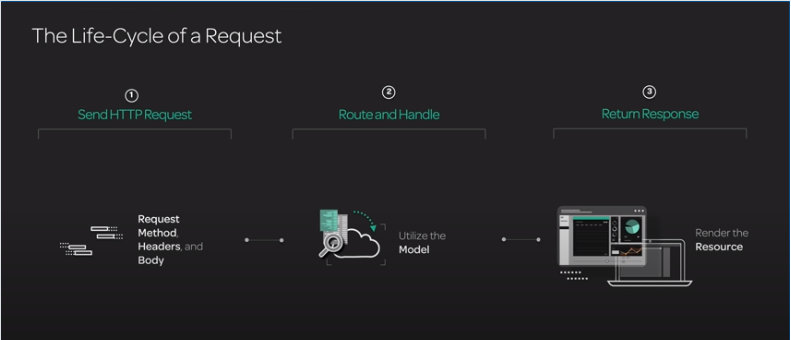

# Learn programming by Python

## WSL

Windows Subsystem for Linux([WSL](https://docs.microsoft.com/en-us/windows/wsl/about)) is an environment in Windows 10 for running unmodified Linux binaries.

### How to enable

```powershell
Enable-WindowsOptionalFeature -Online -FeatureName Microsoft-Windows-Subsystem-Linux
```

> [!IMPORTANT]
> This command require administrative privileges

### How install Ubuntu

Download one of these and install it:

- [Ubuntu 16.04 LTS](https://www.microsoft.com/en-us/p/ubuntu-1604/9pjn388hp8c9)
- [Ubuntu 18.04 LTS](https://www.microsoft.com/en-us/p/ubuntu-1804/9n9tngvndl3q)
- [Ubuntu](https://www.microsoft.com/en-us/p/ubuntu/9nblggh4msv6)

## How install python

### From store

```bash
sudo apt install python3.7
```

### From Source

```bash
sudo -i
apt update -y
apt install -y \
    wget \
    build-essential \
    libffi-dev \
    libgdbm-dev \
    libc6-dev \
    libssl-dev \
    zlib1g-dev \
    libbz2-dev \
    libreadline-dev \
    libsqlite3-dev \
    libncurses5-dev \
    libncursesw5-dev \
    xz-utils \
    tk-dev

cd /usr/src
PYTHON_VERSION=3.8.1
wget http://python.org/ftp/python/$PYTHON_VERSION/Python-$PYTHON_VERSION.tar.xz
tar xf Python-$PYTHON_VERSION.tar.xz
cd Python-$PYTHON_VERSION
./configure --enable-optimizations
make altinstall
exit
```

> [!IMPORTANT]
> make altinstall causes it to not replace the built in python executable.

### Upgrade pip

```bash
pip3.8 install --upgrade pip
```

## Select Text Editor or IDE

Having a well configured text editor can make the programming experience much more enjoyable. Much like a carpenter, having sharp tools leads to a more productive creative experience.

### Terminal based editors

- [Vim](https://www.vim.org/)
- [Emacs](https://www.gnu.org/software/emacs/)
- [Nano](https://www.nano-editor.org/)

### GUI Based Editors

- [Atom](https://atom.io/)
- [VS Code](https://code.visualstudio.com/)

  Suggested extensions(VS Code offer extensions as you keep using it):

  - [Remote - WSL](https://marketplace.visualstudio.com/items?itemName=ms-vscode-remote.remote-wsl)

    > [!IMPORTANT]
    > This extension is required in order to work with `WSL`

    - [Python](https://marketplace.visualstudio.com/items?itemName=ms-python.python)
    - [GitLens — Git supercharged](https://marketplace.visualstudio.com/items?itemName=eamodio.gitlens)
    - [Git History](https://marketplace.visualstudio.com/items?itemName=donjayamanne.githistory)
  - [SublimeText](https://www.sublimetext.com/)
  - [Notepad++](https://notepad-plus-plus.org/)
  - [PyCharm](https://www.jetbrains.com/pycharm/)

## REPL

### What is REPL

REPL stands for: **R**ead, **E**valuate, **P**rint, **L**oop

Each line is read and evaluated. The return value is then printed to the screen, and then the process repeats.

Python ships with a REPL, accessible by running python3.8 from a terminal.

### Using REPL

The `>>>` indicates a line to type in, like a command prompt for Python. Later on we'll see a ..., which means that we are currently sitting in a scoped area. The only way out is to enter a blank line (no spaces) before the interpreter will evaluate the entire code block.

The simplest use of this would be to do some math:

```python
>>> 1 + 1
2
>>>
```

2 is the return value of the expression and it is then printed to the screen. If something doesn't have a return value, then nothing will be printed to the screen and we'll just land back at a `>>>` prompt. We'll cover this later, but an example would be `None`:

```python
>>> None
>>>
```

To exit the REPL, we can either type `exit()` (the parentheses are important) or hit `Ctrl+d` on your keyboard.

## Git

### What is Git

Git is a Distributed Version Control Systems(DVCS) to records changes to a file or set of files over time so that you can recall specific versions later.

### Useful commands

[git clone](https://git-scm.com/docs/git-clone): Clone a git repository to local file system.
[git pull](https://git-scm.com/docs/git-pull): Get changes from the server and merge them with your local copy.
[git status](https://git-scm.com/docs/git-status): Show the working tree status.
[git checkout](https://git-scm.com/docs/git-checkout): Switch branches or restore working tree files.
[git add](https://git-scm.com/docs/git-add): This command updates the index using the current content found in the working tree, to prepare the content staged for the next commit.
[git commit](https://git-scm.com/docs/git-commit): Commit your changes to local git repository.
[git push](https://git-scm.com/docs/git-push): Update remote refs along with associated objects.

## Basics of programming

Writing a program is the art of breaking the problem into small blocks of tasks that work in cooperation with each other to achieve a bigger task and provide a useful service.

### Using comments

Writing a simple program is easy enough, but writing a good program that provide a service for a long time require some skill and to comply with some rule.

Writing a program for an actual useful problem, require many services. And over time many of this services will change. New services will added to the list of required service, some old services will be removed and some of them will be changed.

It is not always the same person that work on a piece of code, so we should write codes in a way that someone else may understand them at a later time. One of the easiest and most efficient ways to express our intention of writing a code is comment, one or two lines of code that describe our intention.

Comments in python start with `#` and continue till the end of the line.

```python
# This is a full line comment
print("Hello user!")    # Great user of the program
```

### Python basic types

#### Strings

Strings are a sequence of characters. In python they will be called [str](https://docs.python.org/3/library/stdtypes.html#text-sequence-type-strl).
They may be quoted with `'` or `"`. There is no difference in using each one of these but internally python will use `'` to represent strings.

```python
>>> 'single quoted string'
'single quoted string'
>>> "double quoted string"
'double quoted string'
>>> print('"double quote" in single quoted string')
"double quote" in single quoted string
>>> print("'single quote' in double quoted string")
'single quote' in double quoted string
```

In order to write long strings that span multiple lines you may use triple quote, either `'''` or `"""`

```python
>>>'''This is line 1 of the string
... This is line 2
... And line3'''
'This is line of the string\nThis is line 2\nAnd line3'
```

In order to write special characters in middle of an string literal we use an escape character. In python this special character is backslash: `\`. Any time that python see `\\` in middle of an string literal it will lookup next character(s) to identify the single character that you wanted to use.
In order to write `\` in a middle of an string you must use `\\`.

```python
>>> print('single quote(\') in middle of single quoted(\') string')
single quote ' in middle of single quoted(') string
>>> print("double quote(\") in middle of double quoted(\") string")
double quote " in middle of double quoted(") string
>>> print("New\nLine")
New
Line
>>> print('Tab\tdelimited')
Tab    delimited
>>> print('Backslash\\ In middle of an string literal')
Backslash\ In middle of an string literal
```

There are a bunch of operations that you can do with strings

```python
>>> 'Hello ' + 'World!'
'Hello World!'
>>> 3 * '!'
'!!!'
>>> '!' * 3
'!!!'
>>> 'Hello ' + 'World' + 3 * '!'
'Hello World!!!'
```

String also have many useful methods:

```python
>>> # Methods to change case of the letters
...
>>> 'test'.upper() # TEST
'TEST'
>>> 'TesT'.upper() # TEST
'TEST'
>>> 'Test'.lower() # test
'test'
>>> 'test'.capitalize() # Test
'Test'
>>> # Methods to search for substrings
...
>>> 'test'.find('e')
1
>>> 'test'.find('st')
2
>>> 'test'.find('T')
-1
```

> [!IMPORTANT]
> In python string literals are **immutable** and you can't change them.

#### Numbers

There are to main types of numbers we'll use in Python: [`int` and `float`](https://docs.python.org/3/library/stdtypes.html#numeric-types-int-float-complex). For the most part, we won't be calling methods on number types — instead, we will use a variety of operators.

```python
>>> 2 + 2 # Addition
4
>>> 10 - 4 # Subtraction
6
>>> 3 * 9 # Multiplication
27
>>> 5 / 3 # Division
1.66666666666667
>>> 5 // 3 # Floor division, always returns a number without a remainder
1
>>> 8 % 3 # Modulo division, returns the remainder
2
>>> 2 ** 3 # Exponent
8
```

If either of the numbers in a mathematical operation in Python is a `float`, then the other will be converted before carrying out the operation and the result will always be a `float`.

```python
>>> 2 + 3.0
5.0
>>> 2 * 3.0
6.0
```

##### Converting Strings and Numbers

It's not uncommon for us to need to convert from one type to another when writing a script. Python provides built-in functions for doing that with the built-in types. For strings and numbers, we can use the `str`, `int`, and `float` functions to convert from one type to another (within reason).

```python
>>> str(1.1)
'1.1'
>>> int("10")
10
>>> int(5.99999)
5
>>> float("5.6")
5.6
>>> float(5)
5.0
```

You'll run into issues trying to convert strings to other types if they aren't present in the string.

```python
>>> float("1.1 things")
Traceback (most recent call last):
  File "<stdin>", line 1, in <module>
ValueError: could not convert string to float: '1.1 things'
```

#### Boolean and None

Python way of representing truthiness and nothingness is [`bool` and `None`](https://docs.python.org/3/library/stdtypes.html#truth-value-testing).

##### Boolean

`bool` represent **truthiness** and Python has two boolean constants: `True` and `False`.

Notice that these both start with capital letters. Later we will learn about comparisons operations, and those will often return either `True` or `False`.

##### Representing Nothingness with `None`

Most programming languages have a type that represents the lack of a value, and Python is no different. The constant used to represent nothingness in Python is `None`. `None` is a **falsy**, and we'll often use it to represent when a variable has no value yet.

An interesting thing to note about `None` is that if you type `None` into your REPL there will be nothing printed to the screen. That's because `None` actually evaluates into nothing.

#### Working with variables

Almost any script we write will need to have a way for us to hold on to information for use later on. That's where variables come into play.

We can assign a value to a variable by using a single `=` and we don't need to (nor can we) specify the type of the variable.

```python
>>> my_var = "This is a simple string"
```

Now we can print the value of that string by using *my_var* later on:

```python
>>> print(my_var)
This is a simple string
>>> print(my_var + '.')
This is a simple string.
```

Before, we talked about how we can't change a string because it's immutable. This is easier to see now that we have variables.

```python
>>> my_var += " testing"
>>> my_var
'This is a simple string testing'
```

That didn't change the string — it reassigned the variable. The original string of `"This is a simple string"` was unchanged.

An important thing to realize is that the contents of a variable can be changed, and we don't need to maintain the same type.

```python
>>> my_str = 'test'
>>> my_str = 1
>>> print(my_str)
1
```

Ideally, we wouldn't change the contents of a variable called `my_str` to be an `int`, but it is something that Python would let us do.

One last thing to remember about variables is that they are just a name for an object. If you create a new variable and assign it to an old variable, then both of them are the names of the same object and we can use both names to reach to same object.
If we reassign any of the variables to another object, we just use this name for another object and old variable will remain the name of the old object.

```python
>>> my_str = 1
>>> my_int = my_str
>>> my_str = "testing"
>>> print(my_int)
1
>>> print(my_str)
testing
```

But if you use any function that modify the object itself, then you can see the change but any of the name

```python
>>> name1 = [1, 2, 3]
>>> name2 = name1
>>> id(name1) # This will be different in each execution of the script. but it will remain constant while it name the same object.
140168663471048
>>> id(name2) # This will also be a different value in each execution but have the same value as id(name1) because both of them name the same object for now
140168663471048
>>> name2
[1, 2, 3]
>>> name1.pop()
3
>>> name2
[1, 2]
>>> name1 += [3, 4]
>>> id(name1) # Note that object is not changed
140168663471048
>>> name2
[1, 2, 3, 4]
>>> name1 = [4, 5]
>>> id(name1)
140168663473224
>>> name2
[1, 2]
```

In case of immutable objects, even when we think we have changed the object, actually python have created another object for us and replaced the original object with it.

```python
>>> my_str = "This"
>>> id(my_str)
140168663441848
>>> my_str += ' is'
>>> id(my_str)    # Note that id is changed, so name `my_str` now point to a different object.
140168663441960
```

One last thing to remember is that if we assign a variable with another variable it will be assigned to the result of the variable and not whatever that variable points to later.

```python
>>> my_str = 1
>>> my_int = my_str
>>> my_str = "testing"
>>> print(my_int)
1
>>> print(my_str)
testing
```

#### Lists

In Python, there are a few different [sequence](https://docs.python.org/3/library/stdtypes.html#sequence-types-list-tuple-range) types that we're going to work with, the most common of which being the [list](https://docs.python.org/3/library/stdtypes.html#list) type.
A list is created in Python by using the square brackets ([, and ]) and separating the values by commas. Here's an example list:

```python
>>> my_list = [1, 2, 3, 4, 5]
```

There's really not a limit to how long our list can be (there is, but it's very unlikely that we'll hit it while scripting)

##### Reading from Lists

To access an individual element of a `list` you can use the index and Python uses a zero based index system.

```python
>>> my_list[0]
1
>>> my_list[2]
3
```

If we try to access an index that is too high (or too low) then we'll receive an error:

```python
>>> my_list[5]
Traceback (most recent call last):
  File "<stdin>", line 1, in <module>
IndexError: list index out of range
```

To make sure that we're not trying to get an index that is out of range, we can test the length using the `len` function (and then subtract 1)

```python
>>> len(my_list)
5
```

Additionally, we can access subsections of a list by **"slicing"** it. We provide the starting index and the ending index (the object at that index won't be included).

```python
>>> my_list[0:2]
[1, 2]
>>> my_list[1:]
[2, 3, 4, 5]
>>> my_list[:3]
[1, 2, 3]
>>> my_list[0::1]
[1, 2, 3, 4, 5]
>>> my_list[0::2]
[1, 3, 5]
```

##### Modifying a List

Unlike strings which can't be modified (you can't change a character in a string), you can change a value in a `list` using the subscript equals operation:

```python
>>> my_list[0] = "a"
>>> my_list
['a', 2, 3, 4, 5]
```

If we want to add to a list we can use the `.append` method. This is an example of a method that modifies the object that is calling the method:

```python
>>> my_list.append(6)
>>> my_list.append(7)
>>> my_list
['a', 2, 3, 4, 5, 6, 7]
```

Lists can be added together (concatenated):

```python
>>> my_list + [8, 9, 10]
['a', 2, 3, 4, 5, 6, 7, 8, 9, 10]
>>> my_list += [8, 9, 10]
>>> my_list
['a', 2, 3, 4, 5, 6, 7, 8, 9, 10]
```

Items in lists can be set using slices also:

```python
>>> my_list[1:3] = ['b', 'c']
>>> my_list
['a', 'b', 'c', 4, 5, 6, 7, 8, 9, 10]
# Replacing 2 sized slice with length 3 list inserts new element
>>> my_list[3:5] = ['d', 'e', 'f']
>>> print(my_list)
['a', 'b', 'c', 'd', 'e', 'f', 6, 7, 8, 9, 10]
>>> len(my_list)
11
```

We can remove a section of a `list` by assigning an empty `list` to the slice:

```python
>>> my_list = ['a', 'b', 'c', 'd', 5, 6, 7]
>>> my_list[4:] = []
>>> my_list
['a', 'b', 'c', 'd']
```

Removing items from a `list` based on value can be done using the `.remove` method:

```python
>>> my_list.remove('b')
>>> my_list
['a', 'c', 'd']
```

Attempting to remove and item that isn't in the `list` will result in an error:

```python
>>> my_list.remove('f')
Traceback (most recent call last):
  File "<stdin>", line 1, in <module>
ValueError: list.remove(x): x not in list
```

Items can also be removed from the end of a list using the `pop` method:

```python
>>> my_list = ['a', 'c', 'd']
>>> my_list.pop()
'd'
>>> my_list
['a', 'c']
```

We can also use the `pop` method to remove items at a specific index:

```python
>>> my_list.pop(0)
'a'
>>> my_list
['c']
>>> my_list.pop(1)
Traceback (most recent call last):
  File "<stdin>", line 1, in <module>
IndexError: pop index out of range
>>> [].pop()
Traceback (most recent call last):
  File "<stdin>", line 1, in <module>
IndexError: pop from empty list
```

#### Tuples and Ranges

The most common immutable [sequence type](https://docs.python.org/3/library/stdtypes.html#sequence-types-list-tuple-range) that we're going to work with is going to be the [tuple](https://docs.python.org/3/library/stdtypes.html#tuple). We'll also look at the [range](https://docs.python.org/3/library/stdtypes.html#range) type as an alternative to a sequential [list](https://docs.python.org/3/library/stdtypes.html#list).

##### Tuples

Tuples are a fixed-width, immutable sequence type. We create tuples using parenthesis (`(`, `)`) and at least one comma (,):

```python
>>> point = (2.0, 3.0)
```

Since tuples are immutable, we don't have access to the same methods that we do on a list. We can use tuples in some operations like concatenation, but we can't change the original tuple that we created.

```python
>>> point_3d = point + (4.0,)
>>> point_3d
(2.0, 3.0, 4.0)
```

One interesting characteristic of tuples is that we can unpack them into multiple variables at the same time:

```python
>>> x, y, z = point_3d
>>> x
2.0
>>> y
3.0
>>> z
4.0
```

The time we're most likely to see tuples will be when looking at a format string that's compatible with Python 2:

```python
>>> print("My name is: %s %s" % ("Mohammad Mahdi", "Roozitalab"))
My name is: Mohammad Mahdi Roozitalab
```

##### Ranges

Ranges are an immutable sequence type that defines a start, a stop, and a step value, and then the values within are calculated as it is interacted with. This allows for ranges to be used in place of sequential lists and while taking less memory and including more items.

```python
>>> my_range = range(10)
>>> my_range
range(0, 10)
>>> list(my_range)
[0, 1, 2, 3, 4, 5, 6, 7, 8, 9]
>>> list(range(1, 14, 2))
[1, 3, 5, 7, 9, 11, 13]
```

Notice that the "stop" value is not included in the range, the values are all up-until the stop.

#### Dictionaries

We will use [dict](https://docs.python.org/3/library/stdtypes.html#mapping-types-dict) type to hold onto key/value information in Python.

[dict](https://docs.python.org/3/library/stdtypes.html#mapping-types-dict) is the main mapping type that we'll use in Python. This object is comparable to a Hash or "associative array" in other languages.
We will use it to hold onto key/value information in Python.

We create dictionary literals by using curly braces (`{` and `}`), separating keys from values using colons (`:`), and separating key/value pairs using commas (`,`). Here's an example dictionary:

```python
>>> ages = { 'kevin': 59, 'alex': 29, 'bob': 40 }
>>> ages
{'kevin': 59, 'alex': 29, 'bob': 40}
```

We can read a value from a dictionary by subscripting using the key:

```python
>>> ages['kevin']
59
>>> ages['billy']
Traceback (most recent call last):
  File "<stdin>", line 1, in <module>
KeyError: 'billy'
```

Keys can be added and their value may be changed using subscripting and assignment:

```python
>>> ages['kayla'] = 21
>>> ages
{'kevin': 59, 'alex': 29, 'bob': 40, 'kayla': 21}
```

Items can be removed from a dictionary using the `del` statement or by using the `pop` method:

```python
>>> del ages['kevin']
>>> ages
{'alex': 29, 'bob': 40, 'kayla': 21}
>>> del ages
>>> ages
Traceback (most recent call last):
  File "<stdin>", line 1, in <module>
NameError: name 'ages' is not defined
>>> ages = { 'kevin': 59, 'alex': 29, 'bob': 40 }
>>> ages.pop('alex')
29
>>> ages
{'kevin': 59, 'bob': 40}
>>> {}.pop('billy')
Traceback (most recent call last):
  File "<stdin>", line 1, in <module>
KeyError: 'billy'
```

Since this is our second time running into a `KeyError` it's worth looking at a way to avoid these when we're attempting to read data from a dictionary. For that, we can use the get method:

```python
>>> ages.get('kevin')
59
>>> ages.get('billy')
>>>
```

Now we're receiving `None` instead of raising an error when we try to get the value for a key that doesn't exist.

It's not uncommon to want to know what keys or values we have without caring about the pairings. For that situation we have the `values` and `keys` methods:

```python
>>> ages = {'kevin': 59, 'bob': 40}
>>> ages.keys()
dict_keys(['kevin', 'bob'])
>>> list(ages.keys())
['kevin', 'bob']
>>> ages.values()
dict_values([59, 40])
>>> list(ages.values())
[59, 40]
```

##### Alternative ways to create a `dict` using Keyword Arguments

There are a few other ways to create dictionaries that we might see, those being using the `dict` constructor with key/value arguments and a list of tuples:

```python
>>> weights = dict(kevin=160, bob=240, kayla=135)
>>> weights
{'kevin': 160, 'bob': 240, 'kayla': 135}
>>> colors = dict([('kevin', 'blue'), ('bob', 'green'), ('kayla', 'red')])
>>> colors
{'kevin': 'blue', 'bob': 'green', 'kayla': 'red'}
```

##### Things to note about dictionaries

- Unlike Python 2 dictionaries, as of Python 3.6 keys are ordered in dictionaries. Will need `OrderedDict` if you want this to work on another version of Python.
- You can set the key to any **IMMUTABLE** type (no `list`)
- Avoid using things other than simple objects as keys.
- Each key can only have one value (so don't have duplicates when creating a `dict`)

### Control flow

#### Conditionals and Comparisons

Scripts become most interesting when they do the right thing based on the inputs that we provide. To start building robust scripts, we need to understand how to make [comparisons](https://docs.python.org/3/library/stdtypes.html#comparisons) and use [conditional blocks](https://docs.python.org/3/tutorial/controlflow.html#if-statements).

##### Comparisons

There are some standard comparison operators that we'll use that match pretty closely to those used in mathematical equations. Let's take a look at them:

```python
>>> 1 < 2
True
>>> 0 > 2
False
>>> 2 == 1
False
>>> 2 != 1
True
>>> 3.0 >= 3.0
True
>>> 3.1 <= 3.0
False
```

If we try to make comparisons of types that don't match up, we will run into errors:

```python
>>> 3.1 <= "this"
Traceback (most recent call last):
  File "<stdin>", line 1, in <module>
TypeError: '<=' not supported between instances of 'float' and 'str'
>>> 3 <= 3.1
True
>>> 1.1 == "1.1"
False
>>> 1.1 == float("1.1")
True
```

We can compare more than just numbers. Here's what it looks like when we compare strings:

```python
>>> "this" == "this"
True
>>> "this" == "This"
False
>>> "b" > "a"
True
>>> "abc" < "b"
True
```

Notice that the string 'b' is considered greater than the strings 'a' and 'abc'. The characters are compared one at a time alphabetically to determine which is greater. This concept is used to sort strings alphabetically.

##### The `in` Check

We often get lists of information that we need to ensure contains (or doesn't contain) a specific item. To make this check in Python, we'll use the `in` and `not in` operations.

```python
>>> 2 in [1, 2, 3]
True
>>> 4 in [1, 2, 3]
False
>>> 2 not in [1, 2, 3]
False
>>> 4 not in [1, 2, 3]
True
```

##### Conditional blocks: if/elif/else

With a grasp on comparisons, we can now look at how we can run different pieces of logic based on the values that we're working with using conditionals. The keywords for conditionals in Python are `if`, `elif`, and `else`. Conditionals are the first language feature that we're using that requires us to utilize whitespace to separate our code blocks. In this document we will always use indentation of 4 spaces. The basic shape of an `if` statement is this:

```python
if CONDITION:
    pass
```

The *CONDITION* portion can be anything that evaluates to `True` or `False`, and if the value isn't explicitly a boolean then it will be converted to determine how to carry out proceed past the conditional (basically using the `bool` constructor).

```python
>>> if True:
...     print("Was True")
...
Was True
>>> if False:
...     print("Was True")
...
>>>
```

To add an alternative code path, we'll use the `else` keyword, followed by a colon (:), and indenting the code underneath:

```python
>>> if False:
...     print("Was True")
... else:
...     print("Was False")
...
Was False
```

In the even that we want to check multiple potential conditions we can use the `elif CONDITION:` statement. Here's a more robust example:

```python
>>> name = "Kevin"
>>> if len(name) >= 6:
...     print("name is long")
... elif len(name) == 5:
...     print("name is 5 characters")
... elif len(name) >= 4:
...     print("name is 4 or more")
... else:
...     print("name is short")
...
name is 5 characters
```

Notice that we fell into the first `elif` statement's block and then the second `elif` block was never executed even though it was true. We can only exercise one branch in an if statement.

#### Logic Operations

Up to this point, we've learned how to make simple comparisons, and now it's time to make compound comparisons using logic/boolean operators.

##### [Boolean Operators](https://docs.python.org/3/library/stdtypes.html#boolean-operations-and-or-not)

###### The `not` Operation

Sometimes we want to know the opposite boolean value for something. This might not sound intuitive, but sometimes we want to execute an `if` statement when a value is `False`, but that's not how the `if` statement works. Here's an example of how we can use not to make this work:

```python
>>> name = ""
>>> not name
True
>>> if not name:
...     print("No name given")
...
No name given
>>>
```

We know that an empty string is a "falsy" value, so `not ""` will always return `True`. `not` will return the opposite boolean value for whatever it's operating on.

###### The `or` Operation

Occasionally, we want to carry out a branch in our logic if one condition *OR* the other condition is `True`. Here is where we'll use the `or` operation. Let's see `or` in action with an `if` statement:

```python
>>> first = ""
>>> last = "Thompson"
>>> if first or last:
...     print("The user has a first or last name")
...
The user has a first or last name
>>>
```

If both first and last were "falsy" then the print would never happen:

```python
>>> first = ""
>>> last = ""
>>> if first or last:
...     print("The user has a first or last name")
...
>>>
```

Another feature of `or` that we should know is that we can use it to set default values for variables:

```python
>>> last = ""
>>> last_name = last or "Doe"
>>> last_name
'Doe'
>>>
```

The `or` operation will return the first value that is "truthy" or the last value in the chain:

```python
>>> 0 or 1
1
>>> 1 or 2
1
```

###### The `and` Operation

The opposite of `or` is the `and` operation, which requires both conditions to be `True`. Continuing with our first and last name example, let's conditionally print based on what we know:

```python
>>> first = "Keith"
>>> last = ""
>>> if first and last:
...     print(f"Full name: {first} {last}")
... elif first:
...     print(f"First name: {first}")
... elif last:
...     print(f"Last name: {last}")
...
First name: Keith
>>>
```

Now let's try the same thing with both first and last:

```python
>>> first = "Keith"
>>> last = "Thompson"
>>> if first and last:
...     print(f"Full name: {first} {last}")
... elif first:
...     print(f"First name: {first}")
... elif last:
...     print(f"Last name: {last}")
...
Full name: Keith Thompson
>>>
```

The and operation will return the first value that is "falsy" or the last value in the chain:

```python
>>> 0 and 1
0
>>> 1 and 2
2
>>> (1 == 1) and print("Something")
Something
>>> (1 == 2) and print("Something")
False
```

#### Loops

It's incredibly common to need to repeat something a set number of times or to iterate over content. Here is where looping and iteration come into play.

##### [The `while` loop](https://docs.python.org/3/tutorial/introduction.html#first-steps-towards-programming)

The most basic type of loop that we have at our disposal is the `while` loop. This type of loop repeats itself based on a condition that we pass to it. Here's the general structure of a `while` loop:

```python
while CONDITION:
    pass
```

The *CONDITION* in this statement works the same way that it does for an `if` statement. When we demonstrated the `if` statement we first tried it by simply passing in `True` as the condition. Let's see when we try that same condition with a while loop:

```python
>>> while True:
...     print("looping")
...
looping
looping
looping
looping
```

That loop will continue forever, we've created an infinite loop. To stop the loop, press *Ctrl-C*. Infinite loops are one of the potential problems with `while` loops if we don't use a condition that we can change from within the loop then it will continue forever if initially true. Here's how we'll normally approach using a `while` loop where we modify something about the condition on each iteration:

```python
>>> count = 1
>>> while count <= 4:
...     print("looping")
...     count += 1
...
looping
looping
looping
looping
>>>
```

We can use other loops or conditions inside of our loops; we need only remember to indent four more spaces for each context. If in a nested context we want to continue to the next iteration or stop the loop entirely we also have access to the `continue` and `break` keywords:

```python
>>> count = 0
>>> while count < 10:
...     if count % 2 == 0:
...         count += 1
...         continue
...     print(f"We're counting odd numbers: {count}")
...     count += 1
...
We're counting odd numbers: 1
We're counting odd numbers: 3
We're counting odd numbers: 5
We're counting odd numbers: 7
We're counting odd numbers: 9
>>>
```

In that example, we also show off how to "string interpolation" in Python 3 by prefixing a string literal with an `f` and then using curly braces to substitute in variables or expressions (in this case the *count* value).

Here's an example using the `break` statement:

```python
>>> count = 1
>>> while count < 10:
...     if count % 2 == 0:
...         break
...     print(f"We're counting odd numbers: {count}")
...     count += 1
...
We're counting odd numbers: 1
```

##### [The `for` Loop](https://docs.python.org/3/tutorial/controlflow.html#for-statements)

The most common use we have for looping is when we want to execute some code for each item in a sequence. For this type of looping or iteration, we'll use the `for` loop. The general structure for a `for` loop is:

```python
for TEMP_VAR in ITERABLE:
    pass
```

The *TEMP_VAR* will be populated with each item as we iterate through the *ITERABLE* and it will be available to us in the context of the loop. After the loop finishes one iteration, then the *TEMP_VAR* will be populated with the next item in the *ITERABLE*, and the loop's body will execute again. This process continues until we either hit a `break` statement or we've iterated over every item in the *ITERABLE*. Here's an example looping over a list of colors:

```python
>>> colors = ['blue', 'green', 'red', 'purple']
>>> for color in colors:
...     print(color)
...
blue
green
red
purple
>>> color
'purple'
```

If we wanted not to print out certain colors we could utilize the `continue` or `break` statements again. Let's say we want to skip the string 'blue' and terminate the loop if we see the string 'red':

```python
>>> colors = ['blue', 'green', 'red', 'purple']
>>> for color in colors:
...     if color == 'blue':
...         continue
...     elif color == 'red':
...         break
...     print(color)
...
green
>>>
```

###### Other Iterable Types

Lists will be the most common type that we iterate over using a `for` loop, but we can also iterate over other iterable types. Of the types we already know, we can iterate over strings, dictionaries, and tuples.

Here's a tuple example:

```python
>>> point = (2.1, 3.2, 7.6)
>>> for value in point:
...     print(value)
...
2.1
3.2
7.6
>>>
```

A dictionary example:

```python
>>> ages = {'kevin': 59, 'bob': 40, 'kayla': 21}
>>> for key in ages:
...     print(key)
...
kevin
bob
kayla
```

A string example:

```python
>>> for letter in "my_string":
...     print(letter)
...
m
y
_
s
t
r
i
n
g
>>>
```

###### Unpacking Multiple Items in a for Loop

We discussed in the tuples section how you could separate a `tuple` into multiple variables by "unpacking" the values. Unpacking works in the context of a loop definition, and you'll need to know this to most effectively iterate over dictionaries because you'll usually want the *key* and the *value*. Let's iterate of a `list` of "points" to test this out:

```python
>>> list_of_points = [(1, 2), (2, 3), (3, 4)]
>>> for x, y in list_of_points:
...     print(f"x: {x}, y: {y}")
...
x: 1, y: 2
x: 2, y: 3
x: 3, y: 4
```

Seeing how this unpacking works, let's use the `items` method on our ages dictionary to list out the names and ages:

```python
>>> for name, age in ages.items():
...     print(f"Person Named: {name}")
...     print(f"Age of: {age}")
...
Person Named: kevin
Age of: 59
Person Named: bob
Age of: 40
Person Named: kayla
Age of: 21
```

### Functions

Being able to write code that we can call multiple times without repeating ourselves is one of the most powerful things that we can do when programming. In python a block of code that can executed multiple times is called a function.

#### [Defining functions](https://docs.python.org/3/tutorial/controlflow.html#defining-functions)

We can create functions in Python using the following:

- The `def` keyword
- The function name - starting with a letter or underscore `_` and continue with a letter, a digit or underscore `_`
- Left parenthesis `(`
- 0 or more argument names
- Right parenthesis `)`
- A colon `:`
- An indented function body

```python
>>> def say_hello():
...     print('Hello from function')
...
>>> say_hello()
Hello from function
```

If we want to have an argument for function, we just name that argument using a variable.

```python
>>> def say_hello(name):
...     print(f'Hello {name!r}')
...
>>> say_hello('Mehdi')
Hello 'Mehdi'
```

Functions also return a result, so we can assign the result of function execution to a variable.

```python
>>> def say_hello(name):
...     print(f'Hello {name!r}')
...
>>> result = say_hello('Mehdi')
>>> result
>>>
```

Since we didn't explicitly returned any value from the function, result of the function is `None`. We can return a result from the function using `return` keyword.

```python
>>> def say_hello(name):
...     return f'Hello {name!r}'
...
>>> result = say_hello('Mehdi')
>>> print(result)
Hello 'Mehdi'
```

#### Working with Multiple Arguments

In a function we can have as many argument as required.

```python
>>> def add(num1, num2):
...     return num1 + num2
...
>>> print(add(100, 200))
300
>>> print(add('Add ', 'strings'))
Add strings
```

Sometimes you may want to have an unlimited number of arguments, this is also possible in python.

```python
>>> def add(*args):
...     result = None
...     for arg in args:
...         if result is None:
...             result = arg
...         else:
...             result += arg
...     return result
...
>>> print(add(100, 200, 300, 400))
1000
>>> print(add('Add ', 'multiple ', 'strings'))
Add multiple strings
```

#### Using Keyword Arguments

Every function call we've made up to this point has used what are known as positional arguments, but if we know the name of the arguments and not necessarily the positions we can call them all using keyword arguments like so:

```python
>>> def contact_card(name, age, car_model):
...     return f"{name} is {age} and drives a {car_model}"
...
>>> contact_card("Keith", 29, "Honda Civic")
'Keith is 29 and drives a Honda Civic'
>>> contact_card(age=29, car_model="Civic", name="Keith")
'Keith is 29 and drives a Civic'
>>> contact_card("Keith", car_model="Civic", age="29")
'Keith is 29 and drives a Civic'
>>> contact_card(age="29", "Keith", car_model="Civic")
  File "<stdin>", line 1
SyntaxError: positional argument follows keyword argument
```

When we're using position and keyword arguments, every argument after the first keyword argument must also be a keyword argument. It's sometimes useful to mix them, but often times we'll use either all positional or all keyword.

Sometimes you don't want a variable to accidentally assigned a value(or simply can't), for example in our *contact_card* function we may want to have a *format* argument that user can only pass it by name.

```python
>>> def contact_card(name, age, car_model, *, format):
...     if format == 'simple':
...         return f"{name} is {age} and drives a {car_model}"
...     else:
...         return(
...             f"name: {name}\n"
...             f"age: {age}\n"
...             f"car model: {car_model}" )
...
>>> print(contact_card("Keith", 29, "Honda Civic", 'advanced'))
Traceback (most recent call last):
  File "<stdin>", line 1, in <module>
TypeError: contact_card() takes 3 positional arguments but 4 were given
>>> print(contact_card("Keith", 29, "Honda Civic", format='simple'))
Keith is 29 and drives a Honda Civic
>>> print(contact_card("Keith", 29, "Honda Civic", format='advanced'))
name: Keith
age: 29
car model: Honda Civic
```

As we could handle infinite amount of positional arguments we may also handle unknown keyword arguments.

```python
>>> def contact_card(name, age, car_model, *, **kwargs):
...     result = f"name: {name}\nage: {age}\ncar model: {car_model}"
...     for key, value in kwargs:
...         result += f"{key}: {value}" )
...     return result
...
>>> print(contact_card("Keith", 29, "Honda Civic", job='Developer', phone=12345678, married=False))
name: Keith
age: 29
car model: Honda Civic
job: Developer
phone: 12345678
married: False
```

#### Defining Default Arguments

Along with being able to use keyword arguments when we're calling a function, we're able to define default values for arguments to make them optional when the information is commonly known and the same. To do this, we use the assignment operator (=) when we're defining the argument.

```python
>>> def contact_card(name, age, car_model = None, *, format='simple'):
...     if format == 'simple':
...         if car_model is None:
...             return f"{name} is {age} and does not have a car"
...         return f"{name} is {age} and drives a {car_model}"
...     else:
...         result = f"name: {name}\nage: {age}\n"
...         if car_model is not None:
...             result += f"car model: {car_model}"
...         return result
...
>>> print(contact_card("Keith", 29))
Keith is 29 and does not have a car
>>> print(contact_card("Keith", 29, "Honda Civic"))
Keith is 29 and drives a Honda Civic
>>> print(contact_card("Keith", 29, format='advanced'))
name: Keith
age: 29
>>> print(contact_card("Keith", 29, "Honda Civic", format='advanced'))
name: Keith
age: 29
car model: Honda Civic
```

Not that we can still use a value for the argument if we want to, but it will use a default value if we omit that variable.

In **python 3.8** we have another option in writing a function, we can force an argument to be only available as positional argument.

```python
>>> def get_length(obj, /): return len(obj)
...
>>> get_length([1, 2, 3])
3
>>> get_length(obj=[1, 2, 3])
Traceback (most recent call last):
  File "<stdin>", line 1, in <module>
TypeError: get_length() got some positional-only arguments passed as keyword arguments: 'obj'
```

### [Classes](https://docs.python.org/3/tutorial/classes.html#classes)

The next step in our programming journey requires us to think about how we can model concepts from our problem's domain. To do that, we'll often use classes to create completely new data types. In this lesson, we'll create our very first class and learn how to work with its data and functionality.

#### Defining classes

Up to this point, we've been working with the built-in types that Python provides (`str`, `int`, `float`, etc.), but when we're modeling problems in our programs we often want to have more complex objects that fit our problem's domain. For instance, if we were writing a program to model information about cars (for an automotive shop) then it would make sense for us to have an object type that represents a car. This is where we start working will classes.

From this point on, most of the code that we'll be writing will be in files. Let's create a *learning_python* directory to hold these files that are really only there to facilitate learning.

```shell
$ mkdir ~/learning_python
$ cd ~/learning_python
$
```

For this lesson, we'll use a file called **creating_classes.py**. Our goal is to model a car that has *tires* and an *engine*. To create a class we use the `class` keyword, followed by a name for the class, starting with a *capital* letter. Let's create our first class, the Car class:

~/learning_python/creating_classes.py:

```python
class Car:
    """
    Docstring describing the class
    """

    def __init__(self):
        """
        Docstring describing the method
        """
        pass
```

This is an incredibly simple `class`. A few things to note here are that by adding a triple-quoted string right under the definition of the `class` and also right under the definition of a `method`/`function` we can add documentation. This documentation is nice because we can even add examples in this string that can be run as tests to help ensure that our documentation stays up to date with the implementation.

A `method` is a function that is defined within the context of an object, and Python classes can define special functions that start with double underscores `__`, such as the `__init__` method. This method overrides the initializer of the `class`. The initializer is what is used when we initialize a new instance of our `class` by running code like this:

```python
>>> my_car = Car()
```

We would like our **Car** class to hold onto a few pieces of data, the *tires*, and an *engine*. For the time being, we're just going to have those be a `list` of strings for the *tires* and a string for the *engine*. Let's modify our `__init__` method to receive engine and tires as arguments:

~/learning_python/creating_classes.py:

```python
class Car:
    """
    Car models a car w/ tires and an engine
    """

    def __init__(self, engine, tires):
        self.engine = engine
        self.tires = tires
```

##### What is `self`

A big change from writing functions to writing methods is the presence of `self`. This variable references the individual instance of the `class` that we're working with. The **Car** `class` holds on to the information about cars in general in our program, where an instance of the **Car** `class` (`self`) could represent my Mercedes specifically. Let's load our `class` into the REPL using python3 -i creating_classes.py, and then we'll be able to create a Mercedes:

```python
$ python3 -i creating_classes.py
>>> mercedes = Car('4-cylinder', ['front-driver', 'front-passenger', 'rear-driver', 'rear-passenger'])
>>> mercedes.tires
['front-driver', 'front-passenger', 'rear-driver', 'rear-passenger']
>>> mercedes.engine
'4-cylinder'
```

Once we have our instance, we're able to access our internal attributes by using a period (`.`).

##### Defining a Custom Method

The last thing that we'll do, to round out the first rendition of our first `class`, is to define a method that prints a description of the car to the screen:

~/learning_python/creating_classes.py

```python
class Car:
    """
    Car models a car w/ tires and an engine
    """

    def __init__(self, engine, tires):
        self.engine = engine
        self.tires = tires

    def description(self):
        print(f"A car with an {self.engine} engine, and {self.tires} tires")
```

Our description method doesn't have any actual arguments, but we pass the instance in as `self`. From there, we can access the instance's attributes by calling `self`.ATTRIBUTE_NAME.

Let's use this new method:

```python
$ python3 -i creating_classes.py
>>> honda = Car('4-cylinder', ['front-driver', 'front-passenger', 'rear-driver', 'rear-passenger'])
>>> honda.engine
'4-cylinder'
>>> honda.tires
['front-driver', 'front-passenger', 'rear-driver', 'rear-passenger']
>>> honda.description
<bound method Car.description of <__main__.Car object at 0x7fb5f3fbbda0>>
>>> honda.description()
A car with a 4-cylinder engine, and ['front-driver', 'front-passenger', 'rear-driver', 'rear-passenger'] tires
```

Just like a normal function, if we don't use parenthesis the method won't execute.

#### Composition

With one custom class under our belt, we're ready to think about how we can use classes together to create full-featured domain models. In this lesson, we'll create another class and utilize it with our **Car** `class`.

##### Modeling the Tire

Currently, our **Car** class has *tires* and an *engine*, but they're all strings and don't really hold the information that we'd expect. For a *tire*, it should probably have these attributes:

- brand - The brand of the tire.
- tire_type - The type of the tire (valid options: None, 'P', 'LT'). We're not using type as the name because it's a name of the built-in function.
- width - The tire width in millimeters
- ratio - The ratio of the tire height to its width. A percentage represented as an integer.
- construction - How the tire is constructed. The default (and only) option is 'R'.
- diameter - The diameter of the wheel in inches.
Let's model our tire by creating a Tire class. We'll create this class in its own file (next to creating_classes.py) called *tire.py*  :

~/learning_python/tire.py

```python
class Tire:
    """
    Tire represents a tire that would be used with an automobile.
    """

    def __init__(self, tire_type, width, ratio, diameter, brand='', construction='R'):
        self.tire_type = tire_type
        self.width = width
        self.ratio = ratio
        self.diameter = diameter
        self.brand = brand
        self.construction = construction
```

Now we have a way to represent an individual *tire*. Let's go into the REPL and pass a list of **Tire** instances as tires when we create a **Car**:

```python
$ python3 -i creating_classes.py
>>> from tire import Tire
>>> tire = Tire('P', 205, 55, 15)
>>> tires = [tire, tire, tire, tire]
>>> honda = Car(tires=tires, engine='4-cylinder')
>>> honda.description()
A car with a 4-cylinder engine, and [<tire.Tire object at 0x7ff1b0a7fe48>, <tire.Tire object at 0x7ff1b0a7fe48>, <tire.Tire object at 0x7ff1b0a7fe48>, <tire.Tire object at 0x7ff1b0a7fe48>] tires
```

A few things to note here:

To load an additional file into the REPL, we were able to reference it by name using from \[FILE_NAME_MINUS_EXTENSION] **import** \[CLASS/FUNCTION/VARIABLE]. We'll learn more about loading code from other modules and packages when we look into the standard library, but this is handy for now.
We created a `list` of tires by using the same tire variable 4 times.
The printing of each tire isn't very readable, and we can see that each item points to the same tire in memory (based on the at *0x7ff1b0a7fe48*).
Before we discuss composition, let's improve this print out by adding a new double underscore method to the Tire class: the `__repr__` method. The `__repr__` method specifies what should be returned when an instance of the `class` is passed to the `repr` function, but also when it printed as part of another object being printed.

~/learning_python/tire.py

```python
class Tire:
    """
    Tire represents a tire that would be used with an automobile.
    """

    def __init__(self, tire_type, width, ratio, diameter,
                 brand='', construction='R'):
        self.tire_type = tire_type
        self.width = width
        self.ratio = ratio
        self.diameter = diameter
        self.brand = brand
        self.construction = construction

    def __repr__(self):
        """
        Represent the tire's information in the standard notation present
        on the side of the tire. Example: 'P215/65R15'
        """
        return (f"{self.tire_type}{self.width}/{self.ratio}"
                + f"{self.construction}{self.diameter}")
```

Now if we repeat the process of creating a car with some tires:

```python
$ python3 -i creating_classes.py
>>> from tire import Tire
>>> tire = Tire('P', 205, 55, 15)
>>> tires = [tire, tire, tire, tire]
>>> honda = Car(tires=tires, engine='4-cylinder')
>>> honda.description()
A car with a 4-cylinder engine, and [P205/55R15, P205/55R15, P205/55R15, P205/55R15] tires
```

Note: If we were just printing the tire by itself then it would use the `__str__` method, and since we didn't implement that, it internally uses the `__repr__` method.

##### What is Composition

What we just did is use "composition" to build up our **Car** `class` by passing in **Tire** objects. One of the big ideas behind *composition* is that we can keep our classes focused on the behaviors and state that pertain to itself, and if it needs functionality from a different object we can *inject* those. The beautiful thing about *composition* is that it allows us to have a clean separation of concerns between our objects, and lets us reuse them. To show the power of *composition*, let's add a *circumference* method to our **Tire** class:

~/learning_python/tire.py

```python
import math

class Tire:
    """
    Tire represents a tire that would be used with an automobile.
    """

    def __init__(self, tire_type, width, ratio, diameter, brand='', construction='R'):
        self.tire_type = tire_type
        self.width = width
        self.ratio = ratio
        self.diameter = diameter
        self.brand = brand
        self.construction = construction

    def circumference(self):
        """
        The circumference of the tire in inches.

        >>> tire = Tire('P', 205, 65, 15)
        >>> tire.circumference()
        80.1
        """
        side_wall_inches = (self.width * (self.ratio / 100)) / 25.4
        total_diameter = side_wall_inches * 2 + self.diameter
        return round(total_diameter * math.pi, 1)

    def __repr__(self):
        """
        Represent the tire's information in the standard notation present
        on the side of the tire. Example: 'P215/65R15'
        """
        return (f"{self.tire_type}{self.width}/{self.ratio}"
                + f"{self.construction}{self.diameter}")
```

Now we can use this method within our **Car** `class` by adding a *wheel_circumference* method:

~/learning_python/creating_classes.py

```python
class Car:
    """
    Car models a car w/ tires and an engine
    """

    def __init__(self, engine, tires):
        self.engine = engine
        self.tires = tires

    def description(self):
        print(f"A car with a {self.engine} engine, and {self.tires} tires")

    def wheel_circumference(self):
        if len(self.tires) > 0:
            return self.tires[0].circumference()
        else:
            return 0
```

This is the power of *composition*. Our **Car** `class` doesn't need to know how to calculate the *circumference* of its wheels (which makes sense, since you can swap out wheels on a car).

```python
$ python3 -i creating_classes.py
>>> from tire import Tire
>>> tire = Tire('P', 205, 65, 15)
>>> tires = [tire, tire, tire, tire]
>>> honda = Car(tires=tires, engine='4-cylinder')
>>> honda.wheel_circumference()
80.1
>>> honda.tires = []
>>> honda.wheel_circumference()
0
```

#### A Quick Look at [Doctests](https://docs.python.org/3.7/library/doctest.html)

You may have noticed the extra content that was added to the docstring of our *circumference* method. This is actually so that we can ensure our implementation works. We've simulated how we would use this code in the REPL, and we can use the `doctest` module to evaluate this, ensuring that the output would match the 80.1 we're expecting. Here's how we would run this:

```shell
$ python3 -m doctest -v tire.py
Trying:
    tire = Tire('P', 205, 65, 15)
Expecting nothing
ok
Trying:
    tire.circumference()
Expecting:
    80.1
ok
4 items had no tests:
    tire
    tire.Tire
    tire.Tire.__init__
    tire.Tire.__repr__
1 items passed all tests:
   2 tests in tire.Tire.circumference
2 tests in 5 items.
2 passed and 0 failed.
Test passed.
```

#### [Inheritance](https://docs.python.org/3.7/tutorial/classes.html#inheritance)

*Composition* is a very powerful tool for code reuse, but one of the other tools that we have at our disposal is *inheritance*. *Inheritance* allows us to create new classes that add or modify the behavior of existing classes. In this lesson, we'll create a different type of **Tire**.

##### Using Inheritance to Customize an Existing Class

Our existing **Tire** implementation does exactly what we need it to do for a general car tire, but there are other, more specific types of tires, such as *racing slicks* or *snow* tires. If we wanted to model these other types of tires, we could use our existing **Tire** class as a start by "inheriting" its existing implementation. Let's add a new **SnowTire** class to our tire.py file:

~/learning_python/tire.py

```python
import math

class Tire:
    """
    Tire represents a tire that would be used with an automobile.
    """

    def __init__(self, tire_type, width, ratio, diameter, brand='', construction='R'):
        self.tire_type = tire_type
        self.width = width
        self.ratio = ratio
        self.diameter = diameter
        self.brand = brand
        self.construction = construction

    def circumference(self):
        """
        The circumference of a tire in inches.

        >>> tire = Tire('P', 205, 65, 15)
        >>> tire.circumference()
        80.1
        """
        side_wall_inches = self._side_wall_inches()
        total_diameter = side_wall_inches * 2 + self.diameter
        return round(total_diameter * math.pi, 1)

    def __repr__(self):
        """
        Represent the tire's information in the standard notation present
        on the side of the tire. Example: 'P215/65R15'
        """
        return (f"{self.tire_type}{self.width}/{self.ratio}"
                + f"{self.construction}{self.diameter}")

    def _side_wall_inches(self):
        return (self.width * (self.ratio / 100)) / 25.4

class SnowTire(Tire):
    def __init__(self, tire_type, width, ratio, diameter, chain_thickness, brand='', construction='R'):
        Tire.__init__(self, tire_type, width, ratio, diameter, brand, construction)
        self.chain_thickness = chain_thickness

    def circumference(self):
        """
        The circumference of a tire w/ show chains in inches.

        >>> tire = SnowTire('P', 205, 65, 15, 2)
        >>> tire.circumference()
        92.7
        """
        side_wall_inches = self._side_wall_inches()
        total_diameter = (side_wall_inches + self.chain_thickness) * 2 + self.diameter
        return round(total_diameter * math.pi, 1)
```

We used another `doctest` here to show the usage of our **SnowTire**.*circumference* method. If we print a **SnowTire** instance it will automatically use the `__repr__` implementation from the **Tire** `class` because we inherited all of the behavior of the **Tire** `class`. We customized both the `__init__` and *circumference* methods to handle the changes that the *chain_thickness* value adds. Because the calculation of the tire sidewall thickness is a little complicated, we extracted that into a separate "private" method so that we could use it in both implementations (the method name starts with a single underscore).

##### Using super()

The *circumference* method is a situation where we needed to make a modification midway through the calculation, so it made more sense to extract a helper method and write a whole new implementation. But most of the time when we're working with *inheritance* it's because we do want most of the initial implementation. In these situations, we have access to the `super` function that allows us to utilize the method implementations from our parent class. As it stands right now, our **SnowTire** `class` will display itself in the same way as the **Tire** class, but we'd like to distinguish them when they're printed out. To do this, we'll override the `__repr__` method, but we want to simply add a *(Snow)* to the end of the original information. Let's utilize `super` to accomplish this:

~/learning_python/tire.py

```python
# Implementation of Tire omitted

class SnowTire(Tire):
    def __init__(self, tire_type, width, ratio, diameter, chain_thickness, brand='', construction='R'):
        Tire.__init__(self, tire_type, width, ratio, diameter, brand, construction)
        self.chain_thickness = chain_thickness

    def circumference(self):
        """
        The circumference of a tire w/ show chains in inches.

        >>> tire = SnowTire('P', 205, 65, 15, 2)
        >>> tire.circumference()
        92.7
        """
        side_wall_inches = self._side_wall_inches()
        total_diameter = (side_wall_inches + self.chain_thickness) * 2 + self.diameter
        return round(total_diameter * math.pi, 1)

    def __repr__(self):
        return super().__repr__() + " (Snow)"
```

This implementation is clean, and allows us to avoid repeating ourselves just to add a small modification to the `__repr__` output. Additionally, we can (and should) use `super` as part of the `__init__` customizations that we made earlier. The existing implementation was how it would be done in Python 2, and you might see it from time to time. But in Python 3, we can leverage `super` in the exact way that we did with `__repr__`. Let's clean up our `__init__` method:
~/learning_python/tire.py

```python
# Implementation of Tire omitted

class SnowTire(Tire):
    def __init__(self, tire_type, width, ratio, diameter, chain_thickness, brand='', construction='R'):
        super().__init__(tire_type, width, ratio, diameter, brand, construction)
        self.chain_thickness = chain_thickness

    def circumference(self):
        """
        The circumference of a tire w/ show chains in inches.

        >>> tire = SnowTire('P', 205, 65, 15, 2)
        >>> tire.circumference()
        92.7
        """
        side_wall_inches = self._side_wall_inches()
        total_diameter = (side_wall_inches + self.chain_thickness) * 2 + self.diameter
        return round(total_diameter * math.pi, 1)

    def __repr__(self):
        return super().__repr__() + " (Snow)"
```

The only real differences are that instead of using the **Tire** constant, we call `super()` and we also don't need to pass self into the call to `__init__`. Using `super` allows us to contain the details about our *superclass* to the initial declaration, and if we end up changing our *superclass* later on we won't need to modify other spots where we hardcoded the *superclass*'s name.

#### Polymorphism

Composition works really well for allowing us to reuse code, and one of the other things that it allows us to do is swap out the dependencies that we pass in. This process works because of the idea of *polymorphism*. In this lesson, we'll learn what *polymorphism* is and how it's used.

##### What is Polymorphism

*Polymorphism* is a pretty strange word that gets used fairly often when talking about object-oriented programming. Thankfully, the concept of *polymorphism* isn't as complicated as the name would imply. Our **Car** `class` is currently taking in a `list` of **Tire** objects, but do they need to be **Tire** instances? Let's take a look at every interaction with the tire instances that happens within the **Car** `class`'s implementation:

~/learning_python/creating_classes.py

```python
class Car:
    """
    Car models a car w/ tires and an engine
    """

    def __init__(self, engine, tires):
        self.engine = engine
        self.tires = tires

    def description(self):
        print(f"A car with a {self.engine} engine, and {self.tires} tires")

    def wheel_circumference(self):
        if len(self.tires) > 0:
            return self.tires[0].circumference()
        else:
            return 0
```

We interact with the tires in two spots:

- When printing in the description method
- By calling the *circumference* method within *wheel_circumference*
If instead of **Tire** instances we used strings for the tires attribute, then we would run into issues because the `str` type doesn't have a `circumference` method. Since variables aren't statically typed in Python (they aren't bound to one specific type) the only thing that we need to do to have our **Car** `class` work is to pass in tires that meet these requirements:

- They can be printed
- They implement the `circumference` method
This is **polymorphism**. It's the idea that we can make different data structures work together so long as the method requirements between them are met. It means that we can pass **SnowTire** instances into a **Car** class where we were currently using **Tire** instances, and there would be no errors or issues.

```shell
$ python3 -i creating_classes.py
>>> from tire import SnowTire
>>> tire = SnowTire('P', 205, 65, 15, 2)
>>> tires = [tire, tire, tire, tire]
>>> honda = Car(tires=tires, engine='4-cylinder')
>>> honda.wheel_circumference()
92.7
```

Technically, we could create a class called **Circle** that also implements a *circumference* method, and that would also work as a "tire" because of **polymorphism**.

### Workshop 1

Python is an object-oriented programming language, and lends itself to modeling problems using objects. In this workshop, we'll be implementing a few different classes in order to create a *todo* list. The project has been documented with *automated tests* to help us verify that the code we've written will meet the requirements.

By the time we're finished with this, we should be more comfortable creating classes and implementing methods on those classes.

#### `Todo` class

The *Todo* class holds onto a few pieces of information:

- **name**: The name of the *todo*
- **description**: The description of the *todo*
- **points**: The difficulty/importance rating as an *integer* greater than zero
- **completed**: Whether or not the todo has been completed as a *boolean*

#### `TodoList` class

The *TodoList* class only receives one argument and implements more functionality:

- **todos**: A list of `Todo` objects
- functionalities:

  - `average_points`: Calculate the average of the points for all of the `Todo` objects. The formula for calculating the average is *sum_of_points* / *number_of_todos*.
  - `completed`: Return list of all completed todos.
  - `incomplete` Return list of all incomplete todos.

### [Modules](https://docs.python.org/3/tutorial/modules.html)

In python everything is defined in a module, you may think of a module as a file that contains a set of variables, functions and classes and all this useful things that defined in this module is accessible by someone else by loading and using this module.

Writing a module is very useful, bu writing everything is very hard an time consuming. Fortunately one of Python's great strengths is that it comes with a standard library containing many useful modules. In this lesson, we'll learn the various ways that we can use modules, and we'll also take a look at some of the commonly used modules.

We've already utilized a standard library package when we used the `math` module to calculate the *circumference* of a **tire**. We used one of the variables from the `math` module in the form of `pi`, but we loaded the entire module using this line:

```python
import math
```

Using `import` we're able to access the internals of the module, by chaining off of the `module`'s name as we did with `pi` using `math.pi`, but there are other ways we could have accessed `pi`. Let's take a look at some of our options:

- `from math import pi` - We can access `pi` by itself, and we can't reference `math` because we used a selective `import`.
- `from math import pi as p` - This would allow us to have access to a `p` variable that contains the value of `pi`.
- `from math import pi, floor, ceil` - This would selectively `import` the pi variable, the `floor` function, and the `ceil` function.
- `from math import *` - This would *import* EVERYTHING (except names starting with an _underscore_) from the `math` module into the current namespace. **Avoid doing this if possible**.

#### Useful Standard Library Modules

Here are some of the most useful standard library modules that we'll use throughout the remainder of the course.

- [argparse](https://docs.python.org/3/library/argparse.html#module-argparse) - for creating CLIs
- [json](https://docs.python.org/3/library/json.html#module-json) - for working with JSON
- [math](https://docs.python.org/3/library/math.html#module-math) - for doing math operations
- [os](https://docs.python.org/3/library/os.html#module-os) - for interacting with operating system resources
- [sys](https://docs.python.org/3/library/sys.html#module-sys) - for interacting with system specific parameters and functions

### Working with Third-Party Packages

The standard library is great, but the vast quantity of third-party packages in the Python ecosystem is also at our disposal. In this lesson, we'll learn how to install Python packages and separate our dependencies using a *virtualenv*.

#### [Using `pip` to Install Packages](https://pip.pypa.io/en/stable/)

As a language with strong open-source roots, Python has a very large repository of open-source packages that can be installed for our use. Thankfully, this repository is easy for us to use, and when we installed Python we were even given the tool to install packages. The simplest tool that we have is `pip`. Since we have more than one Python installation, we need to make sure that we're using the version of `pip` that corresponds to the version of Python that we would like to install the package for. With **Python 3.7**, we'll use **pip3.7**. Let's install our first package, the [requests](https://realpython.com/python-requests/):

```shell
$ pip3.7 install requests
...
Installing collected packages: idna, urllib3, chardet, certifi, requests
Could not install packages due to an EnvironmentError: [Errno 13] Permission denied: '/usr/local/lib/python3.7/site-packages/certifi'
Consider using the `--user` option or check the permissions.
$
```

There's an error because we don't have permissions to install a package globally unless we use `sudo`. If we do use `sudo`, then any other user on the system that could use our Python 3.7 install would also have access to **requests**. An alternative approach is to install the package into a directory for packages only for our user using the *--user* flag when installing. Let's install the package locally to our user:

```shell
$ pip3.7 install --user requests
Collecting requests
...
Installing collected packages: idna, urllib3, chardet, certifi, requests
Successfully installed certifi-2019.11.28 chardet-3.0.4 idna-2.8 requests-2.22.0 urllib3-1.25.8
$
```

The **requests** package has some dependencies, so `pip` also installed those as part of the installation process.

#### Viewing Installed Packages

If we want to view the packages that are already installed we'll also use the `pip` for that using the `pip freeze` command:

```shell
$ pip3.7 freeze
blinker==1.3
certifi==2019.11.28
chardet==3.0.4
command-not-found==0.3
configobj==5.0.6
cryptography==1.2.3
idna==2.8
Jinja2==2.8
jsonpatch==1.10
jsonpointer==1.9
language-selector==0.1
MarkupSafe==0.23
oauthlib==1.0.3
prettytable==0.7.2
pyasn1==0.1.9
pycurl==7.43.0
pygobject==3.20.0
PyJWT==1.3.0
pyserial==3.0.1
python-apt==1.1.0b1
python-debian==0.1.27
python-systemd==231
requests==2.22.0
six==1.10.0
ssh-import-id==5.5
ufw==0.35
unattended-upgrades==0.1
urllib3==1.25.8
```

Since we installed **requests** with the `--user` flag, we'll still see it in this list. But a different user would not. The `freeze` subcommand gives us the information in a format that puts into a file, and then that file could be used to install packages with the specific version. Here's what that would look like:

```shell
$ pip3.7 freeze > requirements.txt
$ pip3.7 install --user -r requirements.txt
...
```

#### Creating a `virtualenv`

If you're working on multiple packages that have varying dependency requirements, you can run into issues if you're installing packages either globally or localized to a user. Python's solution to this is what's known as a "**virtualenv**" (for "virtual environment"). A **virtualenv** is a localized Python install with its own packages, and it can be activated/deactivated. The Python module for creating a **virtualenv** is called `venv`, and we can use it by loading the module and providing a path to where we would like to place the **virtualenv**. Let's create a **virtualenv** where we can install the package **PyYAML**:

```shell
$ sudo apt-get install python3-venv -y
...
$ mkdir ~/venv
$ python3.7 -m venv ~/venv/test_yaml
```

Now we have a `virtualenv`, but we need to "**activate**" it by running a script that was created within the `virtualenv`'s bin directory.

```shell
$ source ~/venvs/pg/bin/activate
(test_yaml) $ python --version
Python 3.7.2
```

The *(test_yaml)* at the front of our prompt is to indicate to us which `virtualenv` we currently have active. While this `virtualenv` is active, the only python in our path is the *Python 3.7* that we used to generate it, and `pip` will install packages for that Python (so we don't need to use `pip3.7`). Let's install the **PyYAML** package:

```shell
(test_yaml) $ pip install PyYAML
Collecting pyyaml
...
Installing collected packages: pyyaml
Successfully installed pyyaml-3.11
```

To **deactivate** our `virtualenv`, we can use the `deactivate` executable that was put into our *$PATH*:

```shell
(test_yaml) $ deactivate
$
```

### Common use cases

#### Interacting with files

There are some core actions that we need to understand how to do in any programming language, in order to be very productive. One of these actions is interacting with files. In this lesson, we'll learn how to read from and write to files, and we'll take a look at how bytes can be represented in code.

##### [Files as Objects](https://docs.python.org/3/glossary.html#term-file-object)

One of the beautiful aspects of working in an object-oriented programming language is that we can represent concepts as objects with functionality. Files are a great use case for this. Python gives us the file object (or concept, really). These objects provide us a few things:

- A read method to access the underlying data in the file
- A write method to place data into the underlying file

To test this out, we're going to create a simple text file with some names it in, and then read and modify it to see what we can learn.

##### Opening a File

The first step to interacting with a file is to "open" it, and in Python we'll use the [open](https://docs.python.org/3/library/functions.html#open) function. This function takes two main arguments:

- `file` - The path to the file on disk (or where you'd like it to create it)
- `mode` - How you would like to interact with the file

The `file` argument is pretty simple, but the `mode` argument has a variety of options that all work a little differently:

- `'r'` - Opens the file for reading, which is the default mode
- `'w'` - Opens the file for writing, while removing the existing content (truncating the file)
- `'x'` - Opens the file to create it, failing if the file already exists
- `'a'` - Opens the file for writing without truncating, appending any new writes to the end of the file
- `'b'` - Opens the file in binary mode, in which the file expects to write and return `bytes` objects
- `'t'` - Opens the file in text mode, the default mode, where the object expects to write and return strings
- `'+'` - Opens the file for reading and writing
These modes can be used in combination, so `'w+b'` is a valid mode saying that we want to read and write with `bytes`, and with the existing file being truncated (from the `'w'`).

Let's create a new script called *using_files.py*, and we'll start interacting with a *file* containing some names. The *file* doesn't exist yet, but if it did, we'd like to truncate it and prepare to write to it.

~/learning_python/using_files.py:

```python
my_file = open('names.txt', 'w+')
```

Now we have a new file object that we can write to.

##### Writing to the File

Before we can read from our *file* we need it to have some content. There are a few primary methods that we'll interact for with this depending on whether or not we want to work with **lines** or **individual characters**. The `write` method only writes the characters that we specify, where the `writelines` method takes a list of strings that should all be on their own *line*. Let's add some names to our file, each on its own *line*, using both methods:

~/learning_python/using_files.py

```python
my_file = open('names.txt', 'w+')
my_file.write('Nelson Mandela\n')
my_file.write('Albert Einstein\n')
my_file.write('Thomas Edison\n')
my_file.writelines([
    'Mahatma Gandhi',
    'Aristotle',
    'Leonardo da Vinci',
])
```

Let's save the file, run it, and then check the contents of names.txt:

```shell
$ python3.7 using_files.py
$ cat names.txt
Nelson Mandela
Albert Einstein
Thomas Edison
Mahatma GandhiAristotleLeonardo da Vinci
$
```

This isn't quite what we expected. You would probably think that `writelines` would add the line ending, but the truth is that we still need to add the `'\n'` to the end of each item. The `writelines` method is more of a shorthand for multiple calls to `write` unless we used `newline='\n'` when we opened the *file*.

Another thing that we didn't do is `close` the file. When we're finished working with a *file*, we should call the `close` method. It's not necessary when running this script because the *file* handle will be closed when the program terminates. But when we're interacting with files, from within a server for instance, the program won't terminate for a long time.

##### Reading from a File

Now that we have some content in the file, let's close it within the script, and then re-open it for reading.

~/learning_python/using_files.py

```python
my_file = open('names.txt', 'w+', newline='\n')
my_file.write('Nelson Mandela\n')
my_file.write('Albert Einstein\n')
my_file.write('Thomas Edison\n')
my_file.writelines([
    'Mahatma Gandhi',
    'Aristotle',
    'Leonardo da Vinci',
])
my_file.close()

my_file = open('names.txt', 'r')
print(my_file.read())
my_file.close()
```

Now we can run the script again to see what happens:

```shell
$ python3.7 using_files.py
Nelson Mandela
Albert Einstein
Thomas Edison
Mahatma Gandhi
Aristotle
Leonardo da Vinci

$
```

Since we're reading the file in **'text'** mode, we'll receive a single string from the `read` method that contains the newline characters and when printed it will print the newlines accordingly. If we didn't want this parsing to occur we could work with the file in `bytes` mode.

If we were to call the `read` method again we would receive an empty string in response. The reason for this is that the *file* holds onto a **cursor** for the location that it's currently at in the *file* and when we read it returns everything after that **cursor** position and moves the **cursor** to the end. To reread the existing content, we'll need to use `seek` to move earlier in the *file*.

##### The `with` Statement

Remembering to close a file that we open can be a little tedious and to get around this Python gives us the with statement. A with statement takes an object that has a close method and will call that method after the block has run.

Let's rewrite our existing code to utilize the with statement:

~/learning_python/using_files.py

```python
with open('names.txt', 'w+') as my_file:
    my_file.write('Nelson Mandela\n')
    my_file.write('Albert Einstein\n')
    my_file.write('Thomas Edison\n')
    my_file.writelines([
        'Mahatma Gandhi',
        'Aristotle',
        'Leonardo da Vinci',
    ])

my_file = open('names.txt', 'r')
with my_file:
    print(my_file.read())
```

When we open the file to write, we're using the shorthand `as` expression to open the file within the `with` statement, and assigning it to the variable `my_file` within the block. This is a really handy tool if we don't need to use the file in any other way. An alternative would be to create the `my_file` variable manually, and then pass the variable into the `with` statement like we did when we were reading from the file.

#### Environment variables

A common way to configure our programs is to use environment variables.
By importing the [os](https://docs.python.org/3/library/os.html) package, we're able to access a lot of miscellaneous operating system level attributes and functions, not the least of which is the [environ](https://docs.python.org/3/library/os.html#os.environ) object. This object behaves like a dictionary, so we can use the subscript operation to read from it.

Let's create a simple script that will read a 'STAGE' environment variable and print out what stage we're currently running in:

```python
#~/learning_python/env_vars.py
import os

stage = os.environ["STAGE"].upper()

output = f"We're running in {stage}"

if stage.startswith("PROD"):
    output = "DANGER!!! - " + output

print(output)
```

We can set the environment variable when we run the script to test the differences:

```shell
$ STAGE=staging python3 env_vars.py
We're running in STAGING
$ STAGE=production python3 env_vars.py
DANGER!!! - We're running in PRODUCTION
```

What happens if the 'STAGE' environment variable isn't set though?

```shell
$ python3 env_vars.py
Traceback (most recent call last):
  File "/home/cloud_user/learning_python/env_vars.py", line 5, in <module>
    stage = os.environ["STAGE"].upper()
  File "/usr/local/lib/python3.7/os.py", line 669, in __getitem__
    raise KeyError(key) from None
KeyError: 'STAGE'
```

This potential **KeyError** is the biggest downfall of using [os.environ](https://docs.python.org/3/library/os.html#os.environ), and the reason that we will usually use [os.getenv](https://docs.python.org/3/library/os.html#os.getenv)

##### Handling A Missing Environment Variable

If the 'STAGE' environment variable isn't set then, we want to default to 'DEV', and we can do that by using the [os.getenv](https://docs.python.org/3/library/os.html#os.getenv) function:

```python
#~/learning_python/env_vars.py

import os

stage = os.getenv("STAGE", "dev").upper()

output = f"We're running in {stage}"

if stage.startswith("PROD"):
    output = "DANGER!!! - " + output

print(output)
```

Now if we run our script without a 'STAGE' we won't have an error:

```shell
$ python3.7 env_vars.py
We're running in DEV
```

#### Error handling

Not everything can go according to plan in our programs, but we should know when these scenarios arise and handle them appropriately.

##### Handling Errors with try/except/else/finally

When we know that there is a possibility that some our code might raise an error, we don't need to just accept it and let our program crash. We can actually handle these errors using the [try](https://docs.python.org/3/reference/compound_stmts.html#the-try-statement) statement. This is a compound statement kind of like the if statement where we will also need to use `except`, and have access to `else` and `finally`. Let's break down what these do by writing a small program that will potentially raise an error. We'll call this program handle_errors.py:

```python
#~/learning_python/handle_errors.py

my_file = open('recipes.txt', 'x')
my_file.write('Meatballs\n')
my_file.close()
```

If we run this script once, then it will run successfully, but if we run it twice we'll see the following error:

```shell
$ python3 handle_errors.py
$ python3 handle_errors.py
Traceback (most recent call last):
  File "handle_errors.py", line 1, in <module>
    my_file = open('recipes.txt', 'x+')
FileExistsError: [Errno 17] File exists: 'recipes.txt'
```

The error is a `FileExistsError` and it's being raised because we're opening the file for creation (using the `x` mode), but it already exists.

To handle this, we need to place our code that could raise an error within a `try` statement and then `except` an error if it happens and do something else.

```python
#~/learning_python/handle_errors.py

import sys

file_name = 'recipes.txt'

try:
    my_file = open(file_name, 'x+')
    my_file.write('Meatballs\n')
    my_file.close()
except:
    print(f"The {file_name} file already exists")
    sys.exit(1)
```

This is the simplest kind of `try`/`except` and this will catch any error that might be raised by `open(file_name, 'x+')`. If we run this file again, we should see our print out.

```shell
$ python3 handle_errors.py
The recipes.txt file already exists
```

We could make this more specific and only except a very specific error, and even have multiple separate `except` blocks catching different kinds of errors. Let's introduce another potential error by passing in a bytes object to a file open in text mode and catch the errors separately:

```python
#~/learning_python/handle_errors.py

import sys

file_name = 'recipes.txt'

try:
    my_file = open(file_name, 'x+')
    my_file.write(b'Meatballs\n')
    my_file.close()
except FileExistsError as err:
    print(f"The {file_name} file already exists")
    sys.exit(1)
except:
    print(f"Unable to write to the file")
    sys.exit(1)
```

Let's run this with an existing file and without:

```shell
$ python3 handle_errors.py
The recipes.txt file already exists
$ rm recipes.txt
$ python3 handle_errors.py
Unable to write to the file
$
```

###### The else and finally Statements

Now we're able to handle errors, but the error handling workflow also facilitates a way for us to run code if there is no error that gets caught using `else`, and there's also a way to run some code after any error handling, or the `else` block, by using `finally`. Since we're using `sys.exit` we wouldn't be able to use `finally` as is, but let's make some modifications to see how both of these work.

```python
#~/learning_python/handle_errors.py

import sys

file_name = 'recipes.txt'

try:
    my_file = open(file_name, 'x+')
    my_file.write('Meatballs\n')
    my_file.close()
except FileExistsError as err:
    print(f"The {file_name} file already exists")
except:
    print(f"Unable to write to the {file_name} file")
else:
    print(f"Wrote to {file_name}")
finally:
    print("Execution complete")
```

Lastly, let's give this a run to see how it goes:

```shell
$ python3 handle_errors.py
The recipes.txt file already exists
Execution complete
$ rm recipes.txt
$ python3 handle_errors.py
Wrote to recipes.txt
Execution complete
```

#### Decorators and higher order function

In addition to being an object-oriented programming language, Python lends itself to applying some ideas from functional programming, because functions are also objects.

##### Higher Order Functions

The distinction between referencing a function and calling a function allows us to pass functions into other functions, and return functions from functions. A function that receives a function argument and/or returns a function is what's known as a "higher-order function." And in Python, there's a special syntax that allows us to apply these functions to the functions that we're defining, in order to get additional functionality.

This probably sounds a little complicated, and it can be, but it can be a very powerful tool once we understand what's going on behind the scenes.

Let's create a new file called decorators.py, and create our first higher-order function that receives a function as an argument:

```python
#~/learning_python/decorators.py

def inspect(func, *args, **kwargs):
    print(f"Running {func.__name__}")
    val = func(*args, **kwargs)
    print(val)
    return val

def combine(a, b):
    return a + b
```

Let's see how we would use this right now in the REPL:

```python
$ python3 -i decorators.py
>>> inspect(combine, 1, 2)
Running combine
3
3
```

This is an example of a higher order function that takes a function argument and uses it, but it's not that useful. A more common way to use higher-order functions in Python is by defining *decorators* which take in a function as an argument and then return a modified version of the function.

##### Decorators

To make `inspect` more useful, we're going to modify it so that we can decorate `combine` when we're defining it. To do this, we'll stop receiving the `*args` and `**kwargs` arguments, receiving just the function instead, and then we'll define a new function within the context of `inspect` before we return it. We'll use the decorator syntax to then wrap `combine`, with `inspect` above the line defining combine. Let's take a look at this in action:

```python
#~/learning_python/decorators.py

def inspect(func):
    def wrapped_func(*args, **kwargs):
        print(f"Running {func.__name__}")
        val = func(*args, **kwargs)
        print(f"Result: {val}")
        return val

    return wrapped_func

@inspect
def combine(a, b):
    return a + b
```

Notice that we're now using `*args` and `**kwargs` in `wrapped_func` and this will allow our returning function to handle any arguments before passing them to *func*.

Now when we call `combine` it will have the added functionality of `inspect` because what we're really calling is the `wrapped_func` returned from `inspect`:

```python
$ python3 -i decorators.py
>>> combine(1, b=2)
Running combine
Result: 3
3
```

By using a decorator, we were able to add additional functionality to `combine` (or any function) without needing to modify the original, pure implementation.

##### Commonly Used Decorators

Now that we know how decorators work, it would be handy to know when to use them. Adding additional printing to functions is something that we can do, but that doesn't mean it's something we should do.

Some of the most common decorators are [classmethod](https://docs.python.org/3/library/functions.html#classmethod), [staticmethod](https://docs.python.org/3/library/functions.html#staticmethod), and [property](https://docs.python.org/3/library/functions.html#property). All of these allow us to modify how method inside of our classes work.

Let's create a new class within decorators.py that uses these decorators to understand what they do:

```python
#~/learning_python/decorators.py

# inspect and combine omitted
class User:
    base_url = 'https://example.com/api'

    def __init__(self, first_name, last_name):
        self.first_name = first_name
        self.last_name = last_name

    @classmethod
    def query(cls, query_string):
        return cls.base_url + '/' + cls.__name__ + '?' + query_string

    @staticmethod
    def name():
        return "User class"

    @property
    def full_name(self):
        return f"{self.first_name} {self.last_name}"
```

This **class** does quite a lot, so let's go through it. First, we're creating a class level variable in `base_url`. This exists on the **class** itself. Next, we're defining our initializer as we've done before. The `query` method is a function that we'd like to exist on the `User` **class** itself, not an *instance* of the class. This is what's known as a "class method." To achieve this, we use the `@classmethod` decorator, and the `User` **class** itself is passed in as the first argument.

The name static method is similar, but a `@staticmethod` doesn't need an implicit argument. It's really just a function that is attached to the `User` **class**, but won't use any of the class's state. Finally, we define the `full_name` method as a property by using the `@property` decorator. By doing this, when we reference `user_instance.full_name` it won't return the function to us, but will instead return the result of the function.

Let's see our class in action:

```python
$ python3 -i decorators.py
>>> User.name
<function User.name at 0x7fcd82686f28>
>>> User.name()
'Kevin Bacon'
>>> User.query('name=test')
'https://example.com/api?name=test'
>>> user = User('Keith', 'Thompson')
>>> user.base_url
'https://example.com/api'
>>> user.full_name
'Keith Thompson'
```

It's worth noting that the `property` decorator is actually a **class** and not a function, and can be used in more complicated ways. I encourage you to read the documentation for it.

##### Decorators with parameters

Sometime our decorator need some data to do its magic. Let's write a decorator that log execution of a function to a file.

```python
#learning_python/decorators_with_args.py

def log_it(log_file):
    def decorator(func):
        def wrapped_func(*args, **kwargs):
            try:
                result = func(*args, **kwargs)
                with open(log_file, 'a'):
                    log_file.write(f'Function {func.__name__} executed successfully\n')
                    log_file.write('--------------------------------\n')
            except Exception as err:
                exc_type, exc_value, exc_traceback = sys.exc_info()
                with open(log_file, 'a'):
                    log_file(f'Exception in executing {func.__name__}: {err!s}\n')
                    log_file.writelines(traceback.format_tb(exc_traceback))
                    log_file.write('--------------------------------\n')
        return wrapped_func
    return decorator
```

In this new decorator we expect a parameter that is name of the log file that we use to write

Here we use [sys.exc_info](https://docs.python.org/3/library/sys.html#sys.exc_info) to extract detailed information of the exception and we used [traceback](https://docs.python.org/3/library/traceback.html) module to access traceback information of the exception.

#### Reading ini files

`ini` format is a very simple and common format for configuration files. In order to work with this format in python we may use `configparser` module.

```python
>>> import configparser
>>> config = configparser.Config()
>>> config.sections()
[]
>>> config.read('example.ini')
['example.ini']
>>> config.sections()
['database']
>>> config['database']['filename']
'test.db'
>>> for key in config['database']:
...   print(f' {key}: {config["database"][key]}')
driver: sqlite3
filename: test.db
create_schema: yes
>>> config.getboolean('database', 'create_schema')
True
>>> config.getboolean('database', 'create_tables', fallback=True)
True
```

#### Working with sqlite databases

SQLite is a [small](https://www.sqlite.org/footprint.html), [fast](https://www.sqlite.org/fasterthanfs.html), [self-contained](https://www.sqlite.org/selfcontained.html), [high-reliability](https://www.sqlite.org/hirely.html), [full-featured](https://www.sqlite.org/fullsql.html), SQL database engine. SQLite is the [most used](https://www.sqlite.org/mostdeployed.html) database engine in the world

In order to connect to databases, we need an special library called database connector. This library knows how best connect to an specific database like MySQL, MSSQL, Oracle and ...

In python there is an standard interface for this connectors called **Python DBI API 2.0**.
Here we use sqlite database format, because it does not need any server. But you can use same API to connect to other databases.

##### Create a connection to database

Before anything we need to create a connection to database passing our connection information like address of server and our credential.
In sqlite we have this:

```python
import sqlite3

con = sqlite3.connect('mydatabase.db')
```

In sqlite, there is an special filename that we can use to create database in memory instead of file system. This is usefull when we want to work with SQL statements to search in our in memory data.

```python
import sqlite3

con = sqlite3.connect(':memory:')
```

##### Cursor

To execute SQL statements in Python, you need a cursor object. You can create it using the `cursor()` method of the **connection** object.

```python
import sqlite3

con = sqlite3.connect(':memory:')
cur = con.cursor()
```

##### Create a Table

To create a table in SQLite3, you can use the *Create Table* query in the `execute()` method. Consider the following steps:

- The connection object is created
- Cursor object is created using the connection object
- Using cursor object, execute method is called with create table query as the parameter

Let’s create employees with the following attributes:

> employees (id, name, salary, department, position, hireDate)

The code will be like this:

```python
import sqlite3

from sqlite3 import Error

def sql_connection():
    try:
        con = sqlite3.connect('mydatabase.db')
        return con
    except Error:
        print(Error)

def sql_table(con):
    cursorObj = con.cursor()

    cursorObj.execute("CREATE TABLE employees(id integer PRIMARY KEY, name text, salary real, department text, position text, hireDate text)")

    con.commit()

con = sql_connection()

sql_table(con)
```

In the above code, we have defined two methods, the first one establishes a connection and the second method creates a cursor object to execute the create table statement.

> [!IMPORTANT]
> The `commit()` method saves all the changes we make. In the end, both methods are called.

##### Insert data into table

To insert data in a table, we use the *INSERT INTO* statement. Consider the following line of code:

```python
cursorObj.execute("INSERT INTO employees VALUES(1, 'John', 700, 'HR', 'Manager', '2017-01-04')")

con.commit()
```

##### Parameterized queries

Using parameter value inside a query has 2 draw backs:

- Lower performance
  - Database engine should compile our arguments back to their values
  - If we execute a single query multiple times, then database engine see each query as a new one and will have to parse them again
- Security risks:
  - Since SQL is a text based protocol that we use to communicate with our database engnire, it is susceptible to parameter injection.

But fortunately there is another way to write our queries:

```python
import sqlite3

con = sqlite3.connect('mydatabase.db')

def sql_insert(con, *entities):
    cursorObj = con.cursor()

    cursorObj.execute('INSERT INTO employees(id, name, salary, department, position, hireDate) VALUES(?, ?, ?, ?, ?, ?)', entities)

    con.commit()

sql_insert(con, 2, 'Andrew', 800, 'IT', 'Tech', '2018-02-06')
```

##### Updating tables

To update the table simply create a connection, then create a cursor object using the connection and finally use the *UPDATE* statement in the `execute()` method.

Suppose that we want to update the name of the employee whose id equals 2. For updating, we will use the *UPDATE* statement and for the employee whose id equals 2. We will use the *WHERE* clause as a condition to select this employee.

Consider the following code:

```python
import sqlite3

con = sqlite3.connect('mydatabase.db')

def sql_update(con, id, name):
    cursorObj = con.cursor()

    cursorObj.execute('UPDATE employees SET name ? where id = ?', (name, id))

    con.commit()

sql_update(con, 2, 'Ali')
```

##### Select statement

The *SELECT* statement is used to select data from a particular table. If you want to select all the columns of the data from a table, you can use the `asterisk (*)`. The syntax for this will be as follows:

```sql
select * from table_name
```

For example, select all the columns of the employees’ table, run the following code:

```python
cursorObj.execute('SELECT * FROM employees ')
```

If you want to select a few columns from a table then specify the columns like the following:

```sql
select column1, column2 from tables_name
```

For example,

```python
cursorObj.execute('SELECT id, name FROM employees')
```

The *SELECT* statement selects the required data from the database table and if you want to `fetch` the selected data, the `fetchall()` method of the *cursor* object is used. This is demonstrated in the next section.

##### Fetch all data

To fetch the data from a database we will execute the *SELECT* statement and then will use the `fetchall()` method of the *cursor* object to store the values into a variable. After that, we will loop through the variable and print all values.

The code will be like this:

```python
import sqlite3

con = sqlite3.connect('mydatabase.db')

def sql_fetch(con):
    cursorObj = con.cursor()

    cursorObj.execute('SELECT * FROM employees')
    for row in cursorObj.fetchall():
        print(row)

sql_fetch(con)
```

If you want to `fetch` specific data from the database, you can use the *WHERE* clause. For example, we want to `fetch` the ids and names of those employees whose _salary_ is greater than 800.

```python
import sqlite3

con = sqlite3.connect('mydatabase.db')

def sql_fetch(con, salary):
    cursorObj = con.cursor()

    cursorObj.execute('SELECT id, name FROM employees WHERE salary > ?', (salary,))
    for row in cursorObj.fetchall():
        print(row)

sql_fetch(con, 800.0)
```

In the above *SELECT* statement, instead of using the `asterisk (*)`, we specified the id and name attributes.

##### Delete data from table

In order to delete data from a table we use *DELETE* statement. just don't forget to use *WHERE* clause, otherwise you will delete all data from your table!.

> [!IMPORTANT]
> *DELETE* always come with a *WHERE* clause

```python
import sqlite3

con = sqlite3.connect('mydatabase.db')

def sql_delete(con, salary):
    cursorObj = con.cursor()

    cursorObj.execute('DELETE FROM employees WHERE salary > ?', (salary,))

sql_delete(con, 200.0)
```

##### rowcount

The `rowcount` is used to return the number of rows that are affected or selected by the latest executed SQL query.

When we use `rowcount` with the *SELECT* statement, -1 will be returned as how many rows are selected is unknown until they are all fetched. Consider the example below:

```python
print(cursorObj.execute('SELECT * FROM employees').rowcount)
```

But if we use `rowcount` with a statement like *DELETE* we can find how many rows actually deleted from the database.

```python
import sqlite3

con = sqlite3.connect('mydatabase.db')

def sql_delete(con, salary):
    cursorObj = con.cursor()

    return cursorObj.execute('DELETE FROM employees WHERE salary > ?', (salary,)).rowcount

print(f'{sql_delete(con, 200.0)} numer of rows deleted from employees')
```

#### Executing external applications

In order to execute external processes and interact with them, we use [subprocess](https://docs.python.org/3/library/subprocess.html) standard module. We mainly use [subprocess.Popen](https://docs.python.org/3/library/subprocess.html#subprocess.Popen) function to capture standard output of the process.

In order to execute an external application we use [subprocess.Popen](https://docs.python.org/3/library/subprocess.html#subprocess.Popen). This function give us the ability to capture the output of executed application and enable us to capture its result.

```python
import sys
import subprocess

try:
    proc = subprocess.Popen(['ls', '-la'], stdout=subprocess.PIPE)
except OSError as err:
    print(f"Error in executing the command: {err}")
    sys.exit(1)

with open('local_file.txt', 'w+b') as f:
    f.write(proc.stdout.read())
```

Remember since in `subprocess.Popen` call, we used a PIPE to capture stdout of the application and that pipe opened in binary mode, result of the `proc.stdout.read()` is of type `bytes` instead of the type `str` that we so used to. So here we have 2 choices:

- Use `bytes.decode(encoding)` to convert the `bytes` buffer to type `str` and then write it to a file that opened in text mode
- Or open the file in binary mode and write that said `bytes` buffer to that binary file.

We used the latter, because it is much more efficient and require less coding.

## Writing web applications using python and flask

### Basics of web development

#### Lifecycle of HTTP requests


A web application is a long running program that receive requests from clients, process them and return responses to those clients.

A single request will be processed like this:

- **Request**: A client make a request to the web application. Each request contains many information but mose important of them are:

  - **HTTP verb**: An HTTP verb indicate what we should do with the request, its like the method that should executed by the web application. And it is usually   one of the following methods:
    - **GET** - This requests a representation of a specific resource. These requests should only receive data, not cause changes.
    - **HEAD** - It's like a **GET** request, but only receives the headers (no response body).
    - **POST** - These submit data to the application, and usually cause a change in the application's state.
    - **PUT** - This replaces the current representation of the target resource.
    - **DELETE** - Just like it sounds, it deletes the specified resource.
    - **PATCH** - These partially modify a resource.
  - **URL**
  
    Address of the resource that method should executed on it. We may look at this like object instances.
  
  - **Headers**: Extra information that may modify how we execute the method and provide extra information to the web application. We may look at this like   arguments for the method.
  
  - **Body**: Optionally request may contains a body that contains extra data about the resource. More on this later.

- **Routing** The web application receive the request and based on its information (VERB, URL, headers) route it to the proper handler in the code.

- **Response** The handler in the web application code process the request and generate a response for it and return that response to the client. This response also include *headers* and may also have a *body*

### MVC

For our application, we're going to be structuring our code using the **MVC** pattern: *Model*, *View*, *Controller*. At its core, **MVC** architecture revolves around 3 concepts:

- **Model** - Holds onto the data and business logic:
Ideally, the model holds onto "the brains" of our application.
- **View** - The representation of our business logic:
For our application, the view portion will be the HTML templates that we render and return.
- **Controller** - The input/output interface for the application:
The controller receives requests and utilizes the model and view to display the proper response. In **Flask**, there are a few different ways to create a "controller," but in its simplest form the controller will actually be the **Flask** application itself.
Unfortunately things become a little confusing with **Flask**, since the functions that receive the requests and are supposed to act as the *controller* are called *views*.

A common problem with **MVC** architecture is that people put too much logic into the controller and view portions, but we'll do our best to keep the important contents in our *Model*.

**Flask** is a micro-framework that doesn't force us to use an **MVC** architecture, and it really doesn't provide us with any structure for doing so, but we can achieve this distinction on our own by building our own distinct modules.

### [Flask](https://flask.palletsprojects.com/en/1.1.x/)

Flask is a web development framework for python, as I said earlier it is a micro framework that let us write very small codes. In fact you may write a whole web server in a single file.

### Our web application

We want to write a web application that keep notes, it will support [markdown](https://daringfireball.net/projects/markdown/syntax) so we may write powerfull notes and it allow us to work with those notes and view them as HTML.

### Setup requirements

First of all we create a folder for our project

```shell
mkdir notes
cd notes
```

Now we initialize this folder as a git repository

```shell
git init
```

And then we create a *.gitignore* for this project. This special file tell the git repository what files should be excluded from git. by default we will download a default .gitignore file for python from the internet.

```shell
curl -o .gitignore https://raw.githubusercontent.com/github/gitignore/master/Python.gitignore
```

Next we create a *virtualenv* for our project, so we can manage our dependencies and python version

```shell
python3 -m venv ./venv
source ./venv/bin/activate
```

And now we install **Flask** in this *virtualenv*

```shell
pip install flask
```

Now we will create 2 special directories that have special meaning for **Flask**

```shell
mkdir templates static
touch {templates,static}/.gitkeep
```

And finally we commit our job so far as initial commit to the git repository

```shell
git add --all .
git commit -m "Initial commit"
```

### Create the application and its databases

For start we create a python file named `__init__` this is standard file for creating a package. It will be used by python package loader to initialize our package.
You may put some codes in this file, and in this case whenever you import your package(named `notes`) you can access everything that defined in this file.

```python
# __init__.py
import os
from flask import Flask

def create_app(test_config=None):
    app = Flask(__name__)
    app.config.from_mapping(
        SECRET_KEY=os.environ.get('SECRET_KEY', default='dev')
    )

    if test_config is None:
        app.config.from_pyfile('config.py', silent=True)
    else:
        app.config.from_mapping(test_config)

    return app
```

Now to run our application we can use:

```shell
export FLASK_ENV=development
export FLASK_APP='.'
flask run --host=0.0.0.0 --port=8000
```

No if we access our application on port 8000 we get an error page that complain about the we application couldn't find the requested URL and the reason is we does not configured **Flask** to know what it should do in case that it received a request for a resource.

For now we stop our server using `Ctrl+C` because we want to add some functionality to it.

As you remeber it, we add our configuration from a python file named `config.py`. So we will create it.

```python
# config.py
import os

db_file = os.environ.get('DB_FILE', default='notes.db')

SQLALCHEMY_TRACK_MODIFICATIONS = False
SQLALCHEMY_DATABASE_URI = f"sqlite:///{db_file}"
```

Now we create a `.env` file to hold our environment variables that configure our application.

```shell
export DB_FILE='notes-db.sqlite'
export FLASK_ENV='development'
export FLASK_APP='.'
```

Now we can run our application using:

```shell
source .env
flask run --host=0.0.0.0 --port=8000
```

As you can see in response of running server we may use the package `python-dotenv` to automatically load `.env` file instead of loading it everytime we want to run our application. So let's go and do that

```shell
pip install python-dotenv
flask run --host=0.0.0.0 --port=8000
```

No we keep our flask application running and modify our code. The beautiful thing about **Flask** is when we run it in *development* mode it will automatically detect changes and reload our web application for us when we change something.

Don't forget to commit your changes to git repository, so you can change your files without the fear of corrupting something.

```shell
git add --all .
git commit -m "Flask setup completed"
```

### Setup models

Now we want to setup the brain of the application: Model.

First we must install a few packages:

```shell
pip install Flask-SQLAlchemy Flask-Migrate
```

And now we create a new file named `model.py` that contains definition of our models.

```python
# model.py
from flask_sqlalchemy import SQLAlchemy

db = SQLAlchemy()
class User(db.Model):
    id = db.Column(db.Integer, primary_key=True)
    username = db.Column(db.String(80), unique=True, nullable=False)
    password = db.Column(db.String(200))
    created_at = db.Column(db.DateTime, server_default=db.func.now())
    updated_at = db.Column(db.DateTime, server_default=db.func.now(), server_onupdate=db.func.now())


class Note(db.Model):
    id = db.Column(db.Integer, primary_key=True)
    title = db.Column(db.String(200))
    body = db.Column(db.Text)
    created_at = db.Column(db.DateTime, server_default=db.func.now())
    updated_at = db.Column(db.DateTime, server_default=db.func.now(), server_onupdate=db.func.now())
```

Now we have our models, but we want them to be related. We want to know who create the `Note` and possibly we want to know list of all `Note`s that created by a user. So we change our model like this:

```python
#model.py
from flask_sqlalchemy import SQLAlchemy

db = SQLAlchemy()
class User(db.Model):
    id = db.Column(db.Integer, primary_key=True)
    username = db.Column(db.String(80), unique=True, nullable=False)
    password = db.Column(db.String(200))
    created_at = db.Column(db.DateTime, server_default=db.func.now())
    updated_at = db.Column(db.DateTime, server_default=db.func.now(), server_onupdate=db.func.now())
    notes = db.relationship('Note', backref='author', lazy=True)

class Note(db.Model):
    id = db.Column(db.Integer, primary_key=True)
    title = db.Column(db.String(200))
    body = db.Column(db.Text)
    created_at = db.Column(db.DateTime, server_default=db.func.now())
    updated_at = db.Column(db.DateTime, server_default=db.func.now(), server_onupdate=db.func.now())
    user_id = db.Column(db.Integer, db.ForeignKey('user.id'), nullable=False)
```

In order to define the shape of our data, we don't need to connect to the database. But after we defined our models we want to connect the `db` to our application and use connection string from our configuration. So we go back to `__init__.py` and modify it to configure `db`.

```python
# __init__.py
import os
from flask import Flask
from flask_migrate import Migrate

def create_app(test_config=None):
    app = Flask(__name__)
    app.config.from_mapping(
        SECRET_KEY=os.environ.get('SECRET_KEY', default='dev')
    )

    if test_config is None:
        app.config.from_pyfile('config.py', silent=True)
    else:
        app.config.from_mapping(test_config)

    from .models import db
    db.init_app(app)

    # setup migrations
    migrate = Migrate(app, db)

    return app
```

Now that we have defined our models and linked it to our application we must initialize our db

```shell
flask db init
```

This will create migration scripts for us, now we must execute those scripts to upgrade our database with our new models:

```shell
flask db upgrade
```

Again remember to commit your work

```shell
git add --all .
git commit -m "Database initialized"
```

### Building User Registration

In order to setup our user registration we go to our beloved `__init__.py` and modify it to add registration ability to the users. In order to do that we want to route all requests to `/sign_up` to be processed by registration handler.

```python
# __init__.py
import os
from flask import Flask, render_template    # This is our first view function
from flask_migrate import Migrate

def create_app(test_config=None):
    app = Flask(__name__)
    app.config.from_mapping(
        SECRET_KEY=os.environ.get('SECRET_KEY', default='dev')
    )

    if test_config is None:
        app.config.from_pyfile('config.py', silent=True)
    else:
        app.config.from_mapping(test_config)

    from .models import db
    db.init_app(app)

    # setup migrations
    migrate = Migrate(app, db)

    # routes
    @app.route('/sign_up')
    def sign_up():
        return render_template('sign_up.html')

    return app
```

Now if you go to your browser and navigate to `http://localhost:8000/sign_up` you will get an error complaining about a missing template. That's because we does not have a template in `templates` folder that named `sign_up.html`.

Go ahead and copy content of `resources/note_templates` to `templates` and contents of `resources/note_static` to `static` folder of your application. Now you can referesh the browser to see the correctly rendered page.

By navigating to `http://localhost:8000/sign_up`, you issue a **GET** request. But when you press then `Sign Up` button, the form will issue a **POST** request. So let's change the code and add the ability to handle **POST** request to the `sign_up` method.

```python
# __init__.py

import os

from flask import Flask, render_template, redirect, url_for, request, flash
from flask_migrate import Migrate
from werkzeug.security import generate_password_hash

def create_app(test_config=None):
    app = Flask(__name__)
    app.config.from_mapping(
        SECRET_KEY=os.environ.get('SECRET_KEY', default='dev')
    )

    if test_config is None:
        app.config.from_pyfile('config.py', silent=True)
    else:
        app.config.from_mapping(test_config)

    from .models import db, User
    db.init_app(app)

    # setup migrations
    migrate = Migrate(app, db)

    # routes
    @app.route('/sign_up', methods=('GET', 'POST'))
    def sign_up():
        if request.method == 'POST':
            username = request.form['username']
            password = request.form['password']
            error = None

            if not username:
                error = 'Username is required.'
            elif not password:
                error = 'Password is required.'
            elif User.query.filter_by(username=username).first():
                error = 'Username is already taken.'

            if error is None:
                user = User(username=username, password=generate_password_hash(password))
                db.session.add(user)
                db.session.commit()
                flash("Successfully signed up! Please log in.", 'success')
                return redirect(url_for('log_in'))

            flash(error, 'error')

        return render_template('sign_up.html')

    @app.route('/log_in')
    def log_in():
        return 'OK'

    return app
```

### Building User Authentication

Until now we enabled the user to create a new user in our application, but now we need our application to recognize that user and provide a way for authenticated user to loging to the system.

In order to do that we must query data from the database, make sure that user information is valid and then save authentication information in a cookie, so on next requests we know that user is already authenticated.

```python
# __init__.py

import os

from flask import Flask, render_template, redirect, url_for, request, flash, session
from flask_migrate import Migrate
from werkzeug.security import generate_password_hash, check_password_hash

def create_app(test_config=None):
    ## ignored previous code

    @app.route('/log_in')
    def log_in():
        if request.method == 'POST':
            username = request.form['username']
            password = request.form['password']
            error = None

            user = User.query.filter_by(username=username).first()
            if user is None or not check_password_hash(user.password, password):
                error = 'Invalid username and/or password'

            if error is None:
                session.clear()
                session['user_id'] = user.id
                return redirect(url_for('index'))

            flash(error, 'error')

        return render_template('log_in.html')

    @app.route('/')
    def index():
        return 'OK'
```

As you can see our `log_in` function have much similarity to the `sign_up` method. Actually this is base of all web development. In every handler you receive the request.

- Extract input parameters from it
- Validate user input
- Do actual task(modify state of the server)
- Return result or redirect user to the location that he/she can retrive the result.

> [!IMPORTANT]
> Just remember you must go back to page templates and update all the locations that contains *href="#"* to point to actual location. The reason that we write *href="#"* in the first place is that the handler must already exists or `url_for` will fail. So until we actually implement the handler for a url we can't use `url_for` to refer to that url.

### Implementing logout

Fortunately this is the easiest step till now. we just have to clear session information and remove the cookie.

```python
# __init__.py

import os

from flask import Flask, render_template, redirect, url_for, request, flash, session
from flask_migrate import Migrate
from werkzeug.security import generate_password_hash, check_password_hash

def create_app(test_config=None):
    ## ignored previous code

    @app.route('/log_in')
    def log_in():
        if request.method == 'POST':
            username = request.form['username']
            password = request.form['password']
            error = None

            user = User.query.filter_by(username=username).first()
            if user is None or not check_password_hash(user.password, password):
                error = 'Invalid username and/or password'

            if error is None:
                session.clear()
                session['user_id'] = user.id
                return redirect(url_for('index'))

            flash(error, 'error')

        return render_template('log_in.html')

    @app.route('/log_out', methods=('GET', 'DELETE'))
    def log_out():
        session.clear()
        flash('Successfully logged out', 'success')
        return redirect(url_for('log_in'))

    @app.route('/')
    def index():
        return 'OK'
```

> [!IMPORTANT]
> We implemented 2 methods for `log_out`, this is because we are deleting user session so the **DELETE** seems like correct method but unfortunately this does not work for the browser. So we also implemented the **GET** method for the browser.

Adding sign up and authentication to our application has forced us to learn a lot about how Flask views, templates, and sessions work. From here, we're ready to add the main feature to our application: note taking!

### Implementing Notes CRUD - Creating and Reading

One of the most common things to implement in any web application is the **CRUD** functionality around a specific type of data: *Create*, *Read*, *Update*, and *Delete*. In this lesson, we'll implement the C and R portions of CRUD for our Note class.

Every note is bound to a user, so before we create our first note, we need to add some code to our application to make working with a logged in user nicer:

- We want to automatically load and populate user information into a context that will be available to the handlers. In *flask* this context is named `g`. I know that this name is not really a good name but it means global context. so we want to populate `g.user` if there is user information in the `session`.
- We want to create a decorator that can wrap views that require a logged in `User` to work.

For the first one, we'll use a different decorator on `app` to state that the specified function should run before the request is processed by a view, using `app.before_request`. To handle the second, we'll use `functools.wraps` to create a decorator that redirects to `/log_in` if g.user is not set. Let's implement these now:

```python
# __init__.py

import os
import functools

from flask import Flask, render_template, redirect, url_for, request, flash, session, g
from flask_migrate import Migrate
from werkzeug.security import generate_password_hash, check_password_hash

def create_app(test_config=None):
    # previous code ommitted

    db.init_app(app)
    migrate = Migrate(app, db)

    # this will be used as a decorator on a view that required a logged in user
    def require_login(view):
        @functools.wraps(view)
        def wrapped_view(**kwargs):
            if not g.user:
                return redirect(url_for('log_in'))
            return view(**kwargs)
        return wrapped_view

    # this will be executed before handling every request, so the code that come after
    # it can easily access user information through g.user
    @app.before_request
    def load_user():
        user_id = session.get('user_id')
        if user_id:
            g.user = User.query.get(user_id)
        else:
            g.user = None

    # Remaining code omitted
```

`require_login` function does a few things:

- Takes in a view to decorate
- Defines the `wrapped_view` that decorates the *view*, redirecting if there is no user and calling the original *view* if there is

The used of `functools.wraps` allows the `wrapped_view` that we return to copy some of the contents that are implicitly designated for a function, such as `__name__`. So the `wrapped_view.__name__ == view.__name__` would be true.

The `load_user` function doesn't do anything but assign `g.user` if there is a `user_id` in the `session`. Without adding any more code, we can actually see changes to our navigation now.

#### Creating a Note

We need to create a few different routes for our Notes CRUD:

- `/notes` The notes index that will list out the currently logged in `User`'s notes
- `/notes/new` The note creation page that will have a form for creating a new note
- `/notes/<note_id>/delete` This route will be used to delete a note by handling using either a **GET** or **DELETE** method. If we receive that request, then we'll delete the note with the given *note_id*. The most accurate HTTP method to use is **DELETE**, but browsers mostly utilize **GET** and **POST** so we'll support **GET** to avoid writing *JavaScript* code to execute our request.
- `/notes/<note_id>/edit` The note edit page to allow us to make modifications to an existing note

```python
# __init__.py

# Imports omitted

def create_app(test_config=None):
    # Initial setup omitted

    from .models import db, User, Note

    db.init_app(app)
    migrate = Migrate(app, db)

    # Earlier views omitted

    @app.route('/notes')
    @require_login
    def note_index():
        return 'Note Index'

    @app.route('/notes/new', methods=('GET', 'POST'))
    @require_login
    def note_create():
        if request.method == 'POST':
            title = request.form['title']
            body = request.form['body']
            error = None

            if not title:
                error = 'Title is required.'

            if not error:
                note = Note(author=g.user, title=title, body=body)
                db.session.add(note)
                db.session.commit()
                flash(f"Successfully created note: '{title}'", 'success')
                return redirect(url_for('note_index'))

            flash(error, 'error')

        return render_template('note_create.html')

    return app
```

When we're dealing with the 'C' in CRUD it usually goes the same way. We check if the request is a **POST** request, validate the information, create the object, and then redirect *OR* render the original page with errors to display.

Looking at our *note_create.html* template, the only new thing is that we're now setting the value for our inputs to match the corresponding item in *request.form*. If there is an error, we'll re-render the page with the content that the user created.

Now that we have a note, we can implement the 'R' portion of CRUD by implementing the note index page and the note show page.

#### Parsing Markdown

Parsing markdown and displaying it is something that's outside the scope of this course, but this is a great situation where we can rely on the open source community and pull in another dependency. We're going to use on the mistune markdown parsing library, so let's install that now:

```shell
(notes) $ pip install mistune
...
```

There are a few ways that we can use this, but in general, we need to use a **mistune.Markdown** object or the **mistune.markdown** function to take the text that we store in `Note.body`. We'll add a new calculated property to our Note class called body_html. Here's what it looks like:

```python
# models.py

from flask_sqlalchemy import SQLAlchemy
from mistune import markdown

# db and User omitted

class Note(db.Model):
    id = db.Column(db.Integer, primary_key=True)
    title = db.Column(db.String(200))
    body = db.Column(db.Text)
    created_at = db.Column(db.DateTime, server_default=db.func.now())
    updated_at = db.Column(db.DateTime, server_default=db.func.now(), server_onupdate=db.func.now())
    user_id = db.Column(db.Integer, db.ForeignKey('user.id'), nullable=False)

    @property
    def body_html(self):
        return markdown(self.body)
```

Now we're able to use `note.body_html` in our templates to render out the *HTML*.

#### Rendering Notes

Now that we can convert the `Note.body` into *HTML*, let's implement the *note_index* view so that we can see our notes from the UI.

```python
# __init__.py:

# Imports omitted

def create_app(test_config=None):
    # Earlier code omitted

    @app.route('/notes')
    @require_login
    def note_index():
        return render_template('note_index.html', notes=g.user.notes)

    # Remaining views omitted

    return app
```

Because we're using `require_login`, we know that we'll never make it into the `note_index` view if there is not a `g.user` object. From there, we're able to simply pass the currently logged in user's notes to the template as the variable "notes", by using the corresponding keyword argument in the template we're rendering.

```html
<!--templates/note_index.html-->




  
    <div class="content">
      <p>You haven't created any notes! <a href="{{ url_for('note_create') }}">Create your first note.</a>
    </div>
  

  
    <article class="message">
      <div class="message-header">
        <p>{{ note.title }}</p>
        <div>
          <a class="button is-primary is-small has-text-weight-bold" href="#">
            Edit Note
          </a>
          <a class="button is-danger is-small has-text-weight-bold" href="#">
            Delete Note
          </a>
        </div>
      </div>
      <div class="message-body content">
        {{ note.body_html|safe }}
      </div>
    </article>
  

```

For the most part, we've seen everything in this template already. The exception being `|safe` when we're rendering out the `note.body_html`. This is a **Jinja** filter, and the safe filter will tell **Jinja** that it should not *escape* the value coming from **Python**. Instead, we've already declared it to be *safe* to render.

Now if we log in and head to */notes*, we can see the notes that we've created. And if we used fenced code blocks, we'll even see them rendered with syntax highlighting, thanks to some *JavaScript* packaged with the *static* assets.

### Implementing Notes CRUD - Updating and Deleting

Editing and updating a note isn't much different from creating a note, but it does give us the ability to use **dynamic** routes that contain variables. We'll almost use the exact same template. Let's create our *note_update* view now:

```python
# __init__.py:

# Imports omitted

def create_app(test_config=None):
    # Earlier code omitted

    db.init_app(app)
    migrate = Migrate(app, db)

    def require_login(view):
        @functools.wraps(view)
        def wrapped_view(**kwargs):
            if not g.user:
                return redirect(url_for('log_in'))
            return view(**kwargs)
        return wrapped_view

    @app.errorhandler(404)
    def page_not_found(e):
        return render_template('404.html'), 404

    # Earlier views omitted

    @app.route('/notes/<note_id>/edit')
    @require_login
    def note_update(note_id):
        note = Note.query.filter_by(user_id=g.user.id, id=note_id).first_or_404()
        return render_template('note_update.html', note=note)

    return app
```

This is the first time that we've taken in user input in our routes, so we need to handle potential **404** errors if the object that the user is requesting doesn't exist, or they don't have access to it. In this case, we can search for a *Note*, with the proper *user_id*, and id using the `first_or_404` feature of *Flask-SQLAlchemy*. By using this, if the object is not found, then we'll stop processing the current view and instead abort with a **404** error. To make that fit with our application, we created another view called `page_not_found`, and registered it as the `errorhandler` for **404** errors thrown by our application.

Let's take a look at the template that we're rendering now:

```html
<!--templates/note_update.html-->





  <h1 class="is-size-3">Edit Note: {{ note.title }}</h1>

  <form action="{{ url_for('note_update', note_id=note.id) }}" method="PATCH">
    <div class="field">
      <label class="label" for="title">Title</label>
      <div class="control">
        <input name="title" value="{{ request.form['title'] or note.title }}" class="input"></input>
      </div>
    </div>

    <div class="field">
      <label class="label" for="body">Body (Supports Markdown)</label>
      <div class="control">
        <textarea name="body" class="textarea has-text-monospaced">{{ request.form['body'] or note.body }}</textarea>
      </div>
    </div>

    <div class="field is-grouped">
      <div class="control">
        <input type="submit" value="Update Note" class="button is-primary" />
      </div>
      <div class="control">
        <a href="{{ url_for('note_index') }}" class="button is-text">Cancel</a>
      </div>
    </div>
  </form>


```

This form is almost exactly like the creation form, but we needed to change the method to **PATCH**. We could potentially be doing a partial update to a note when we submit the form. The action also had to change, and this is a good opportunity to look at how `url_for` works when we have an argument in the URL. Lastly, we're setting the values of the title's *input* and the body's *textarea* to be either the value from the request or the existing value on the *note* variable. We're using this approach so that the user doesn't lose all of their edits if there is a validation error when we go to handle the update. Nobody wants to have to start over when there's a form error.

Let's go ahead and implement the update handling now:

```python
# __init__.py:

# Imports omitted

def create_app(test_config=None):
    # Earlier code omitted

    @app.route('/notes/<note_id>/edit', methods=('GET', 'PATCH'))
    @require_login
    def note_update(note_id):
        note = Note.query.filter_by(user_id=g.user.id, id=note_id).first_or_404()
        if request.method == 'PATCH':
            title = request.form['title']
            body = request.form['body']
            error = None

            if not title:
                error = 'Title is required.'

            if not error:
                note.title = title
                note.body = body
                db.session.add(note)
                db.session.commit()
                flash(f"Successfully updated note: '{title}'", 'success')
                return redirect(url_for('note_index'))

            flash(error, 'error')

        return render_template('note_update.html', note=note)

    return app
```

There's only one real big difference between what we're doing in this view and in the `note_create` view. We're reassigning the *title* and *body* on an existing Note before adding it to the list of updates to make, instead of creating a whole new object. Now when we go to our edit page and submit the form with differences, we can see that it's just sending us back to the edit page without changing anything and our URL has all of the contents of our form. What happened?

While **PATCH** is the proper *HTTP* method to use when partially updating a model, it doesn't work in HTML form tags. In this case, we'll adjust the form to have a **POST** method instead and we'll change our view to handle GET, POST, and PATCH.

[!IMPORTANT]
> Be sure to change the method in templates/note_update.html to **POST** first.

```python
# __init__.py:

# Imports omitted

def create_app(test_config=None):
    # Earlier code omitted

    @app.route('/notes/<note_id>/edit', methods=('GET', 'POST', 'PATCH'))
    @require_login
    def note_update(note_id):
        note = Note.query.filter_by(user_id=g.user.id, id=note_id).first_or_404()
        if request.method in ['POST', 'PATCH']:
            title = request.form['title']
            body = request.form['body']
            error = None

            if not title:
                error = 'Title is required.'

            if not error:
                note.title = title
                note.body = body
                db.session.add(note)
                db.session.commit()
                flash(f"Successfully updated note: '{title}'", 'success')
                return redirect(url_for('note_index'))

            flash(error, 'error')

        return render_template('note_update.html', note=note)

    return app
```

Now if we refresh the edit page so that the HTML changes and then we submit some changes we should see them happen as expected. We're supporting both **POST** and **PATCH** because it's the right thing to do.

#### Deleting a Note

The last thing that we're going to do is handle the deleting of a note. To do this, we're going to have a view for both **GET** and **DELETE**, without a template. We will utilize `first_or_404` again, and then once we have the note we'll use `db.session.delete(note)` to get rid of it before redirecting back to the note *index* page. Let's add the code now:

```python
# __init__.py:

# Imports omitted

def create_app(test_config=None):
    # Earlier code omitted

    @app.route('/notes/<note_id>/delete', methods=('GET', 'DELETE'))
    @require_login
    def note_delete(note_id):
        note = Note.query.filter_by(user_id=g.user.id, id=note_id).first_or_404()
        db.session.delete(note)
        db.session.commit()
        flash(f"Successfully deleted note: '{note.title}'", 'success')
        return redirect(url_for('note_index'))

    return app
```

We should edit the delete links within *note_index.html* to use `url_for('note_delete', note_id=note.id)`, and then we'll be able to delete a note from the note *index* page.

We've successfully implemented all of the **CRUD** functionality for our notes and now we have a working application. There's more we could do to improve security and add additional functionality, but this project has done a good job of showing us how web development in general works, and some of the things that we have to consider when writing web-based applications.

### Organizing Flask Apps with Blueprints

There are some rumors about the **flask** that it is a microframework that is just intender for small applications and not really big servers.

- First of all microframework does not mean that it is intended for big applications, it just mean that it only contains bare minimum for framework to work and actually this is very good because we can write smaller applications that only contains what we need.
  But what about those extra functionality that come with bigger frameworks that come with bigger frameworks? am I to implement them myself?
  fortunately the answer is no, since **flask** is getting more and more popularity there are tons of packages for it that do almost anything required for a web application (as you see in case of Flask-SQLAlchemy or Flask-Migrate)
- Second reason behind this rumores is the way that we learn the flask.
  writing everything in a single file (either `__init__.py` or `app.py`) somehow force us to use **flask** for smaller applications.
  but this is not the only way or even the best way to write an application. putting all the logic of the application into a single file make that single file so complicated and hard to manage.
  fortunately there is very easy to use way to handle this in flask called **blueprint**

#### What is a blueprint

Good software is organized by separation of concerns. It's easy to think of an application as a single entity, yet reality shows us that well-structured apps are collections of standalone modules, services, or classes. I'm referring to the **Single-responsibility** principal: a commonly understood concept where each piece of an application should be limited to handling no more than a single responsibility. It's the same reason why bathrooms and kitchens are separate rooms: one room is for shitting, and one room is for eating. It's a mess to shit where you eat, which is precisely what happens when building applications without structure or encapsulation.

We can organize our **Flask** apps via a built-in concept called **Blueprints**, which are essentially the **Flask** equivalent of Python modules. **Blueprints** are intended to encapsulate feature-sized sections of our application, such as checkout flows, user auth, user profiles, etc. **Blueprints** keep related logic and assets grouped and separated from one another, which is essential to designing a maintainable project. **Blueprints** also enable performance benefits associated with code-splitting, similar to Webpack.

#### Conventional Flask Structure

The best way to get a glance at the benefits associated with using Blueprints is to see the effect they have on an app’s structure. First, let’s look at what a large app might look like without Blueprints.

Our *notes* application so far look something like this

```shell
/myapp
├── /templates
├── /static
├── __init__.py
├── models.py
├── config.py
└── requirements.txt
```

Our application is not that big yet, and for simple applications like that this structure is not that bad. Actually it may be the best way to go, since it is easy to understand and write the code. But as we add more features to out applications this may not be the best way to write the code.

Now with blueprints we can write it as:

```shell
/notes
├── /application
│   ├── __init__.py
│   ├── assets.py
│   ├── api.py
│   ├── /auth
│   │   ├── /templates
│   │   ├── /static
│   │   └── auth.py
│   ├── /home
│   │   ├── /templates
│   │   ├── /static
│   │   └── home.py
│   ├── /profile
│   │   ├── /templates
│   │   ├── /static
│   │   └── profile.py
│   ├── /static
│   └── /templates
├── README.md
├── config.py
├── requirements.txt
└── __init__.py
```

Unlike previous application we can easily indicate different parts of the application in a single view and easily deply and test different parts of the application. You can even have different persons to work on different parts of the application.

A substantial benefit of blueprints is the ability to separate page templates and static assets into blueprint-specific */templates* and */static* folders. Now our landing page won't find itself loading irrelevant CSS, which pertains to product pages, and vice versa.

An important thing to point out is the presence of top-level */templates* and */static* folders in addition to their blueprint-specific equivalents. While blueprints cannot access the templates or static files of their peers, they can utilize common assets to be shared across all blueprints (such as a *layout.html* template, or a general *style.css* file that applies to all parts of our app). We'll dig into how assets and blueprints work together, but let's start by defining our first blueprint.

#### Defining a Blueprint

We start with home blueprint, this is actually same as what we do till now.

```python
# home/home.py

from flask import Blueprint
from flask import current_app as app

# blueprint configuration
home_bp = Blueprint('home_bp', __name__,
                    template_folder='templates',
                    static_folder='static')
```

We're configuring our Blueprint as a variable named `home_bp`. The first parameter we pass to `Blueprint()` is the name we want to assign to our `Blueprint` for Flask's internal routing purposes. It makes sense to keep things consistent by naming our Blueprint `home_bp` to stay consistent with our variable name.

We also pass two optional keyword arguments called `template_folder` and `static_folder`. Defining these arguments tells our blueprint that we'll have blueprint-specific templates and static files. These directories are resolved in relation to the current file, thus registering our blueprint's template and static directories as *application/home/templates* and *application/home/static*, respectively.

Setting `static_folder` mimics the behavior of setting `template_folder`, except for serving static assets.

```python
# home/home.py

from flask import Blueprint
from flask import current_app as app

# blueprint configuration
home_bp = Blueprint('home_bp', __name__,
                    template_folder='templates',
                    static_folder='static')

@home_bp.route('/', methods=['GET'])
def home():
    return 'OK'
```

The only notable difference here is that we now register our route by using `@home_bp.route('...')` instead of `@app.route('...')`. Creating our `home_bp` **Blueprint** automatically gives us a decorator function called `@home_bp` with which we can register our routes to.

#### Registering Our Blueprint

We've created a **Blueprint** and registered our first route to it, but how do we tell our Flask app that this blueprint and its routes exist?

This is where we break into our top-level entry point, like `__init__.py` in the Flask application factory pattern. Here's the simplest example of registering a Blueprint using this pattern:

```python
# __init__.py
import os
from flask import Flask
from flask_migrate import Migrate

def create_app(test_config=None):
    app = Flask(__name__)
    app.config.from_mapping(
        SECRET_KEY=os.environ.get('SECRET_KEY', default='dev')
    )

    if test_config is None:
        app.config.from_pyfile('config.py', silent=True)
    else:
        app.config.from_mapping(test_config)

    from .models import db
    db.init_app(app)

    # setup migrations
    migrate = Migrate(app, db)

    from .home import home
    app.register_blueprint(home.home_bp)

    return app
```

We can define and register rest of the blueprints just like that.

#### Jinja Templates Routing with Blueprints

A caveat we need to be aware of is how *Jinja* templates find URLs for routes registered to **Blueprints**. Let's say we want to create a link to our app's homepage. In an app without blueprints, you'd find the route for our homepage using the following:

```html
<!-- index.html -->

<a href="{{ url_for('home') }}">Home</a>
```

This looks for a route named home registered directly to our `app`, but in our case, we don't have routes registered to our `app`. In our app, we don't register routes directly to the Flask app — we've registered them to blueprints instead.

This is where the `home_bp` part of `home_bp = Blueprint('home_bp')` comes into play: the string `home_bp` we passed into our blueprint is the internal name Flask uses to resolve routes with! Now we can find our homepage by doing the following:

```html
<!-- index.html -->

<a href="{{ url_for('home_bp.home') }}">Home</a>
```

#### Jinja Blueprint Extras

Since *Jinja* is contextually aware of blueprints, we can use a few cool tags to verify where we are in our app. Here are some useful tools to demonstrate how powerful *Jinja* is when it comes to knowing each page template's context:  

`{{ request.blueprint }}`: Output the blueprint name that the current page template belongs to.
`{{ self._TemplateReference__context.name }}`: Renders the file name of the current page template.
`{{ request.endpoint }}`: Outputs both the name of the current blueprint as well as the name of the route which served the page template.
`{{ request.path }}`: The URL of the current page template.
